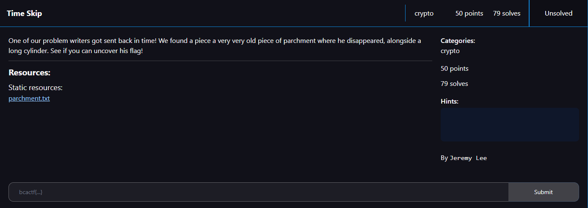
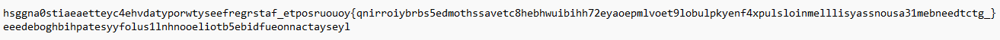
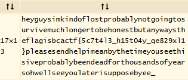

# Time Skip

I downloaded the file and opened it:

I put the text into `dcode.fr`'s cipher identifier, which identified that a Scytale cipher was used to encode the text. I then put the text into their Scytale cipher decoder:

I then submitted `bcactf{5c7t4l3_h15t04y_qe829xl1}` as the flag and solved the challenge.
