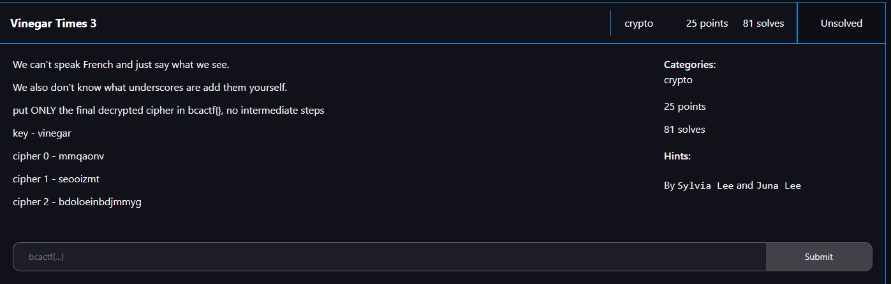

# Vinegar Times 3




Mentions French, so I looked up French cipher, which came up to be Vingenere Cipher. Using the key of vinegar, I was able to decrypt `mmqaonv` to:

```txt
redwine
```

I then used “redwine” as the key to decrypt `seooizmt`, which resulted in: 

```txt
balsamic
```

I then used “balsamic” as the key to decrypt `bdoloeinbdjmmyg`, which resulted in: 

```txt
addtosaladyummy
```

Since the challenge text tells me to only include the last cipher and add spaces, I submitted `bcactf{add_to_salad_yummy}` as the flag and solved the challenge.
