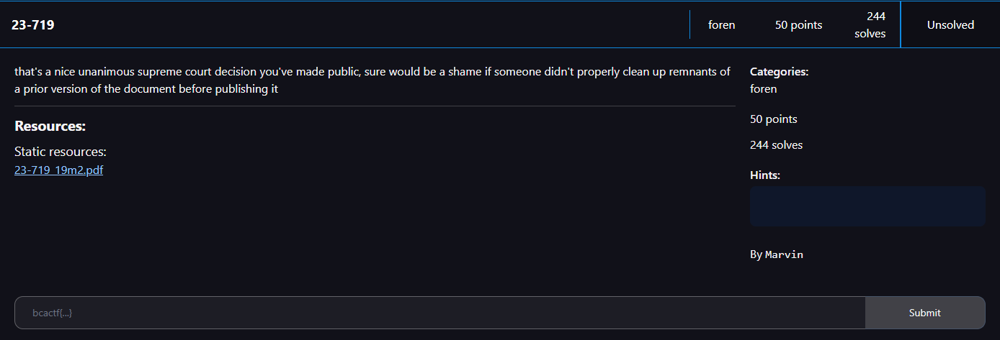
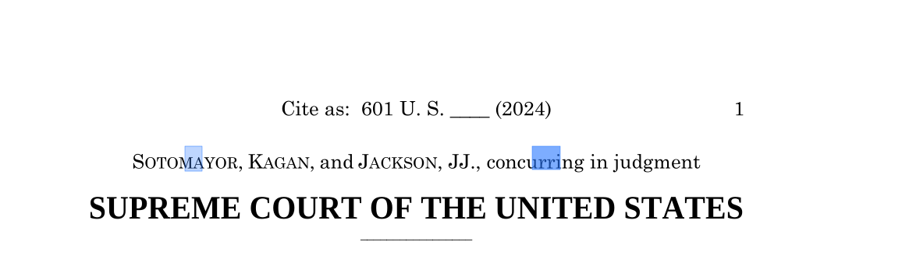
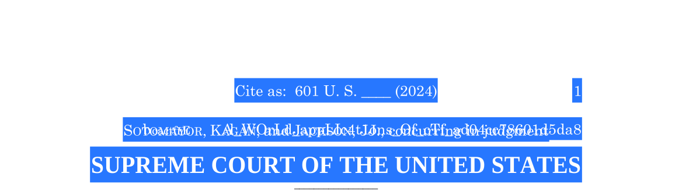
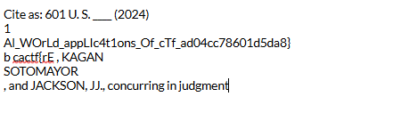
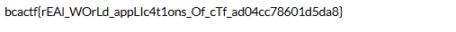

# 23-719

I downloaded the file, which was a pdf of the Supreme Court's ruling in Trump v Anderson. My first intuition was to Ctrl-F the word "ctf" to see if the flag was hidden between the paragraphs:

I don't see the word "ctf" here. So why is it showing up? I decided to highlight the text with my mouse:

Seems like some text is hidden in the words,so I copied and pasted the text to an online notepad:

I see the flag, I just need to clean the text up a bit:

I then submitted `bcactf{rEAl_WOrLd_appLIc4t1ons_Of_cTf_ad04cc78601d5da8}` as the flag and solved the challenge.
