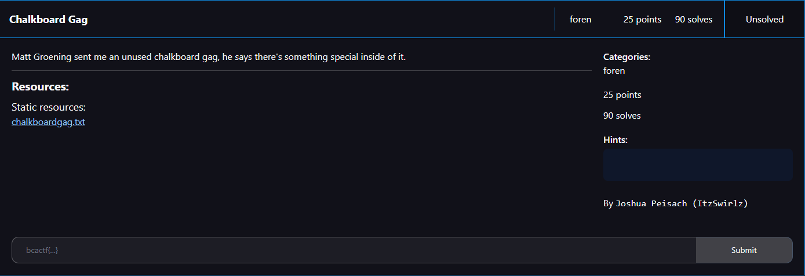
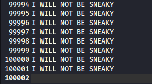
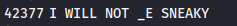
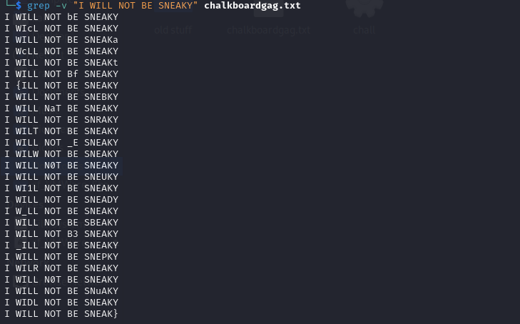
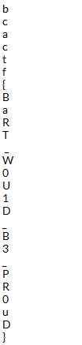

# Chalkboard Gag

I downloaded the file and opened it:

It’s 100001 lines of: "I WILL NOT BE SNEAKY". Anyway something is most likely hidden. While scrolling through the text, I noticed this:

So I used `grep -v "I WILL NOT BE SNEAKY" chalkboardgag.txt`. The `-v` flag tells `grep` to return what doesn't match, which is useful for finding small differences in a massive wall of text like the one shown in this challenge:

Now I just have to clean it up a bit:

I then submitted `bcactf{BaRT_W0U1D_B3_PR0uD}` as the flag and solved the challenge.
