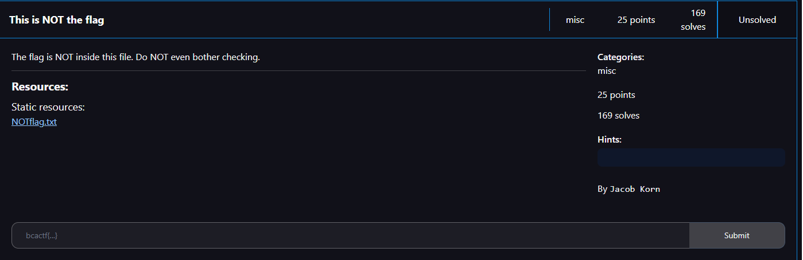
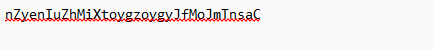
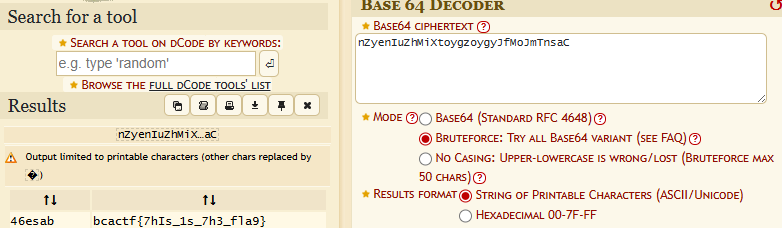

# This is NOT the flag

I downloaded the file and opened it:

That kind of looks like Base64, so I used dcode.fr’s base64 decoder with the brute force option turned on:

I then submitted `bcactf{7hIs_1s_7h3_fla9}` as the flag and solved the challenge.
