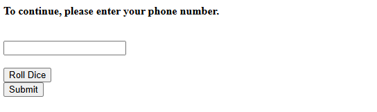

# Phone number

I click on the link, which takes me to this webpage:

I first try to type the phone number directly into the box, but I am unable to do so. It appears that the box doesn't take input directly. Instead, I will have to roll the dice and hope that the numbers from the dice are the same numbers as the phone number. I roll the dice a couple of times, being able to add the number generated by the dice roll to the box, or subtract a value from the number, which will then be added to the dice box. However, after a few more dice rolls, I roll snake eyes, which resets everything and clears the box. Obviously, I am not supposed to solve this challenge through dice rolls. There has to be another way. So, I load up Burpsuite and play around with the website until I notice this in Burpsuite:

I wondered what would happen if I changed `1244` to `1234567890`? So I changed the request in Burpsuite:

I then sent the request, which resulted in:

I then submitted `bcactf{PHoN3_num8eR_EntER3D!_17847928}` as the flag and solved the challenge.
