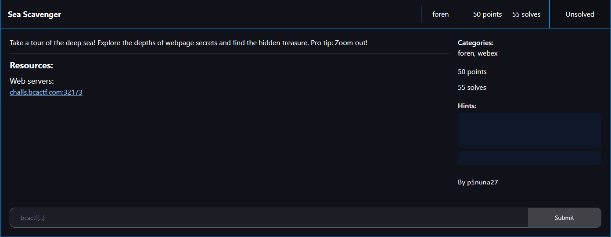

# Sea Scavenger

I clicked on the link, which took me to a website that seemed zoomed in. To see if anything interesting was hiding that I couldn't see with the current zoom level, I zoomed out in my browser:

The treasure chest seemed interesting, so I clicked on it:

Since was a web challenge, I assumed the "robots" in the text was robots.txt. I then attempted to access robots.txt through the use of directory traversal:

Well, at least I had the end portion of the flag. I then embarked on a hunt to find the rest of the flag. There were a lot of animals I could click on, so I decided to start from the top:

## Shark

The HTML of a website can be used by looking at it's source code. So I used the Edge DevTools to view the webpage's source code:

## Squid

Mentioning the word "console" was a dead giveaway to check the console in DevTools:

## Clam

From personal experience, I knew that cookies were a sweet treat. I also knew that websites used "cookies" to store browser information. So I checked the cookies in DevTools: 

## Ship

Burpsuite is a great tool for seeing all the traffic going in and out of a website along with the requests and responses, so I opened the page in Burpsuite. I then noticed in the response headers for the page:

## Whale

The inclusion of the word "sources" was a dead giveaway to check the sources tab in DevTools:

Now with everything found, I submitted `bcactf{b3t_y0u_d1dnt_f1nd_th3_tre4sur3_t336e3}` and solved the challenge.
