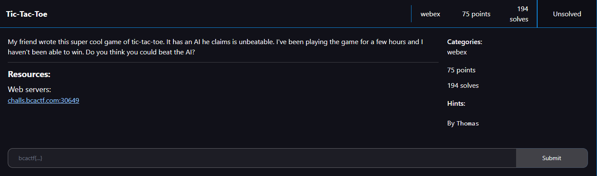
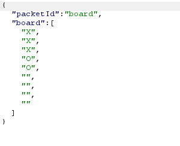

# Tic Tac Toe

I clicked on the link and it took me to this webpage:

I played the game but couldn’t win against the computer. So I checked the network tab in the Edge DevTools:

Seems like the websockets are responsible for placing the X’s and O’s. I then opened up the page in Burpsuite, and checked Burpsuite’s websocket history:

Seems like it is responsible for placing the X on the board, so I sent:

Which resulted in: 

I then set an “X” to position 1:

Which resulted in:

I then set an X to position 2, which was already occupied by an “O”:

Which resulted in:

Which then resulted in this websocket:

This was the full interaction:

I then submitted `bcactf{7h3_m4st3r_0f_t1ct4ct0e_678d52c8}` as the flag and solved the challenge.

