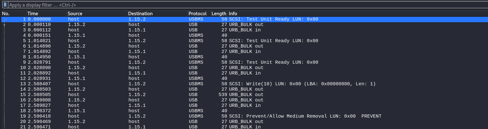
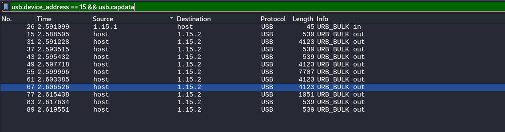

# Recursion


I download `usb.pcapng` onto my Kali Linux VM and open Wireshark:



I find packets 15, 31, 49, 55, 61, 67, and 77 to be interesting, as they contain a lot more data than the other packets. Additionally, they have text in the packet output. They also all have the header of `URB_BULK out`, and go to USB bus 15. So, I create a filter in wireshark by inputting:

```txt
usb.device_address == 15 && usb.capdata
```

In the filter box. I made a filter as I wanted to make sure that I didn't miss any other "interesting" packets while scrolling through all of the packets. I then execute the filter, which results in:



I then used `tshark` to extract the filtered packets by using the command:

```txt
tshark -r usb.pcapng -Y 'usb.capdata and usb.device_address==15' -T fields -e usb.capdata > raw
```

Which I then converted to binary using:

```txt
xxd -r -p raw output1.bin
```

I then used `binwalk` on `output1.bin` to extract the contents of `output1.bin`, typing:

```txt
binwalk -e output1.bin
```

Which results in `_output1.bin.extracted` being created. I then explore the contents of `_output1.bin.extracted`, which reveals a file titled `layer4.pcapng`. Since the challenge name is `Recursion`, and there was a pcap inside `usb.pcapng`, I repeat the process again:

```txt
tshark -r layer4.pcapng -Y 'usb.capdata and usb.device_address==15' -T fields -e usb.capdata > raw
xxd -r -p raw output2.bin`
```

I then attempted to use `binwalk -e` to extract the contents of `output2.bin`, however, `binwalk` didn't extract anything, despite showing:

```txt
DECIMAL       HEXADECIMAL     DESCRIPTION
--------------------------------------------------------------------------------
9746          0x2612          7-zip archive data, version 0.4
```

So, I typed:
```txt
binwalk --dd='.*'  output2.bin
```

In order to force extract the file. 

Which results in `_output2.bin.extracted` being created. I then explore the contents of `_output2.bin.extracted`, which contains a zip folder titled `2612.zip`. I unzip `2612.zip`, which reveals that `2612.zip` contained a file titled, `layer3.pcapng`. So, I repeat the process again:

```txt
tshark -r layer3.pcapng -Y 'usb.capdata and usb.device_address==15' -T fields -e usb.capdata > raw
xxd -r -p raw output3.bin
binwalk --dd='.*'  output3.bin
```
Which results in a folder titled `_output3.bin.extracted`. I then explore the contents of `_output3.bin.extracted`, which contains a zip folder titled `2612.zip`. I unzip `2612.zip`, which reveals that `2612.zip` contained a file titled, `layer2.pcapng`. So I repeat the process again:

```txt
tshark -r layer2.pcapng -Y 'usb.capdata and usb.device_address==15' -T fields -e usb.capdata > raw
xxd -r -p raw output4.bin`
binwalk --dd='.*'  output4.bin
```

Which results in a folder titled `_output4.bin.extracted`. I then explore the contents of `_output3.bin.extracted`, which contains a zip folder titled `4612.zip`. I unzip `4612.zip`, which reveals that `4612.zip` contained a file titled, `layer1.pcapng`. So, I repeat the process again:

```txt
tshark -r layer1.pcapng -Y 'usb.capdata and usb.device_address==15' -T fields -e usb.capdata > raw
xxd -r -p raw output5.bin`
binwalk --dd='.*'  output5.bin
```

But, `binwalk` doesn't find anything to be extracted, which means this is the end of the road. Now, since I am at the end of the recursion, the flag must be hidden inside of `layer1.pcapng`. So, I type:

```txt
strings layer1.pcapng | grep crew
```
Which results in:

```txt
crew{l00ks_l1ke_y0u_mad3_1t!}
```

I then submit `crew{l00ks_l1ke_y0u_mad3_1t!}`, and solve the challenge.


