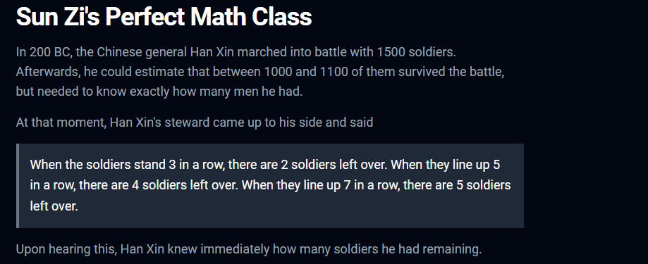
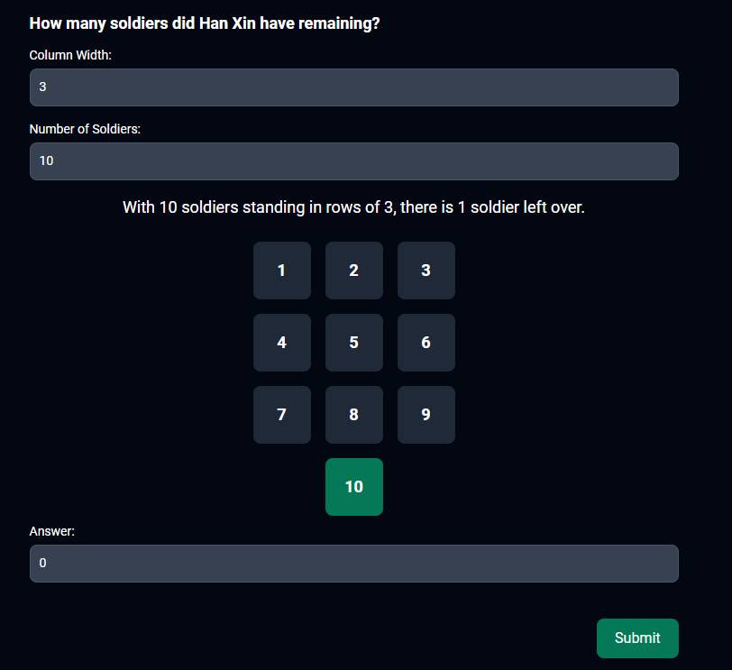
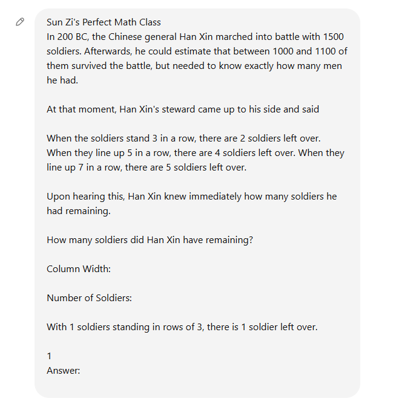
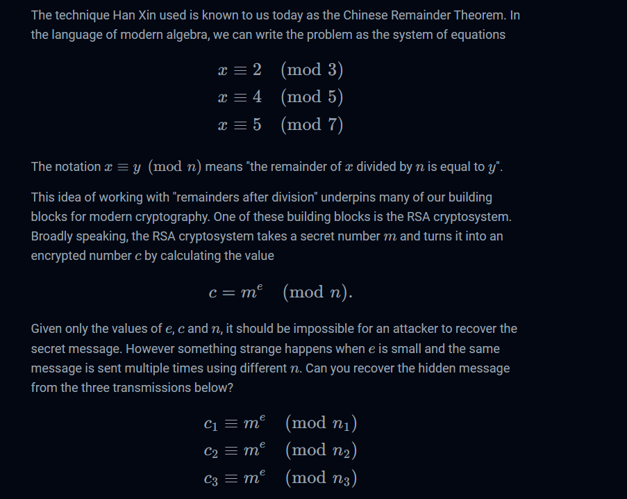
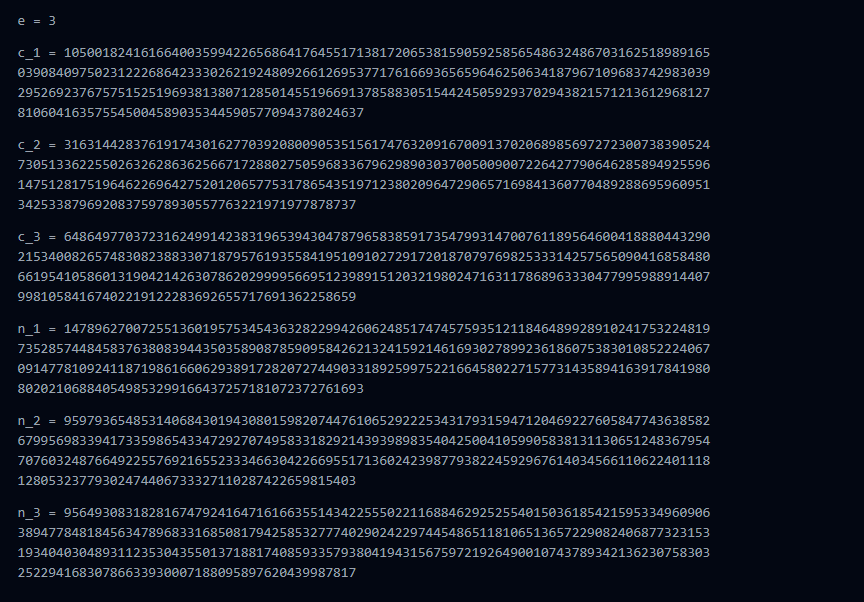

# Sun Zi's Perfect Math Class


I clicked on the link, which took me to this webpage:





I then crafted this ChatGPT prompt:



I executed the prompt, which resulted in ChatGPT telling me that `1034` was the answer to the question. So, I submitted `1034` into the answer box, which resulted in:





I then copied and pasted the transmission into the ChatGPT prompt box. I then asked ChatGPT to write a script to decode the transmissions. After I sent the prompt, this script was returned:

```txt
from sympy import mod_inverse, integer_nthroot

# Given values
e = 3

c1 = int("105001824161664003599422656864176455171381720653815905925856548632486703162518989165039084097502312226864233302621924809266126953771761669365659646250634187967109683742983039295269237675751525196938138071285014551966913785883051544245059293702943821571213612968127810604163575545004589035344590577094378024637")
c2 = int("31631442837619174301627703920800905351561747632091670091370206898569727230073839052473051336225502632628636256671728802750596833679629890303700500900722642779064628589492559614751281751964622696427520120657753178654351971238020964729065716984136077048928869596095134253387969208375978930557763221971977878737")
c3 = int("64864977037231624991423831965394304787965838591735479931470076118956460041888044329021534008265748308238833071879576193558419510910272917201870797698253331425756509041685848066195410586013190421426307862029999566951239891512032198024716311786896333047799598891440799810584167402219122283692655717691362258659")

n1 = int("147896270072551360195753454363282299426062485174745759351211846489928910241753224819735285744845837638083944350358908785909584262132415921461693027899236186075383010852224067091477810924118719861660629389172820727449033189259975221664580227157731435894163917841980802021068840549853299166437257181072372761693")
n2 = int("95979365485314068430194308015982074476106529222534317931594712046922760584774363858267995698339417335986543347292707495833182921439398983540425004105990583813113065124836795470760324876649225576921655233346630422669551713602423987793822459296761403456611062240111812805323779302474406733327110287422659815403")
n3 = int("95649308318281674792416471616635514342255502211688462925255401503618542159533496090638947784818456347896833168508179425853277740290242297445486511810651365722908240687732315319340403048931123530435501371881740859335793804194315675972192649001074378934213623075830325229416830786633930007188095897620439987817")

# Step 1: Compute the product of the moduli
N = n1 * n2 * n3

# Step 2: Compute the individual partial products
N1 = N // n1
N2 = N // n2
N3 = N // n3

# Step 3: Compute the modular inverses
M1 = mod_inverse(N1, n1)
M2 = mod_inverse(N2, n2)
M3 = mod_inverse(N3, n3)

# Step 4: Calculate the solution using the formula
m3 = (c1 * N1 * M1 + c2 * N2 * M2 + c3 * N3 * M3) % N

# Step 5: Compute the cube root of m^3
m, exact = integer_nthroot(m3, e)
if not exact:
    m += 1  # Correct for possible off-by-one error in integer_nthroot

print(f"Recovered message: {m}")
```

I copied and pasted the script into a python file, which I named `math_class_solve.py`. I then ran `math_class_solve.py`, which resulted in:

```txt
Recovered message: 11564025922867522871782912815123211630478650327759091593792994457296772521676766420142199669845768991886967888274582504750347133
```

I then inputted `11564025922867522871782912815123211630478650327759091593792994457296772521676766420142199669845768991886967888274582504750347133` into the answer box, and submitted my answer, which resulted in:


I then submitted  `DUCTF{btw_y0u_c4n_als0_us3_CRT_f0r_p4rt14l_fr4ct10ns}` and solved the challenge.
