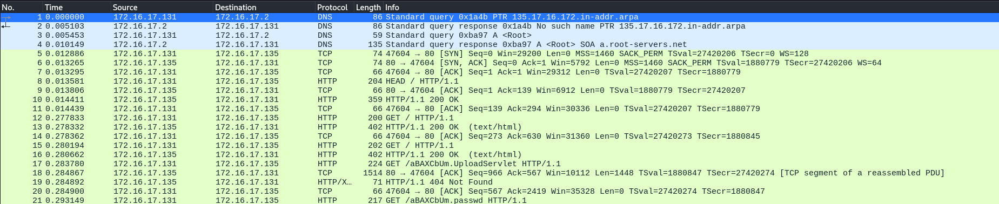
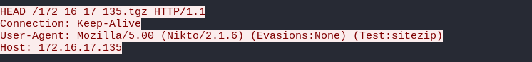

# Baby's First Forensics

I downloaded `capture.pcap` onto my Kali Linux VM. I then opened the pcap in Wireshark:

Since it was a mix of HTTP, TCP, and DNS packets, I navigated to `Follow -> HTTP stream` option by rightclicking one of the packets. I chose to view the HTTP streams as HTTP is transmitted without any encryption (this is the main reason why your browser will alert you if you navigate to an HTTP site). I started from stream 0, and began to browse through the streams. When I navigated to the 6th HTTP stream, I noticed:

From this packet, the host belonging to the ip address `172.16.17.135` is using `Nikto 2.1.6`. Nikto is a web vulnerability scanner that scans webservers for vulnerabilities.  So, based off the challenge description, I submitted `DUCTF{Nikto_2.1.6}`, and solved the challenge.
