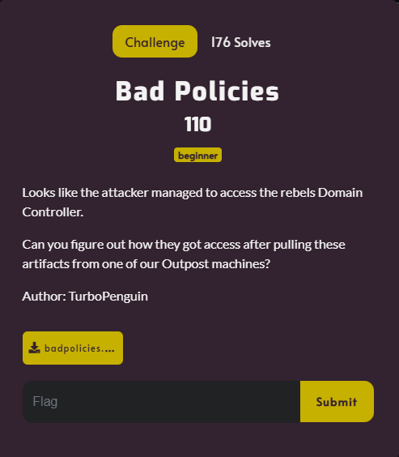
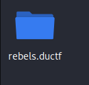
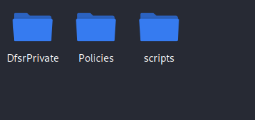
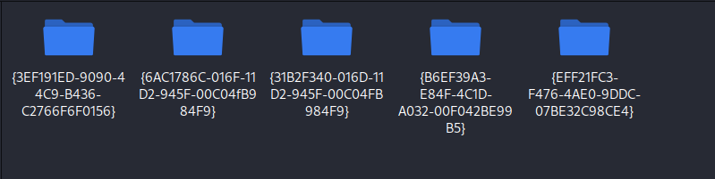
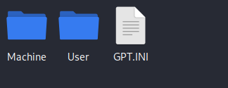
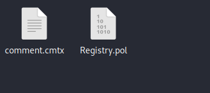
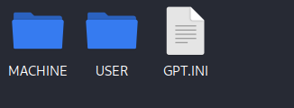

# Bad Policies



I downloaded `badpolicies.zip` and placed it onto my Kali Linux VM. I then proceeded to unzip it, which revealed:



`rebels.ductf` contained:



`DfsrPrivate` sounded interesting, so I opened it:


Nothing. So, I then decided to see what the `scripts` folder contained:


Maybe the `Policies` folder will contain something?



Finally. I then went through the folder titled `{3EF191ED-9090-44C9-B436-C2766F6F0156}`:



`GPT.INI` contained:

```txt
[General]
Version=5
displayName=New Group Policy Object
```

The `User` folder contained:


While the `Machine` folder contained:



The contents of `comment.cmtx` were:

```txt
<?xml version='1.0' encoding='utf-8'?>
<policyComments xmlns:xsd="http://www.w3.org/2001/XMLSchema" xmlns:xsi="http://www.w3.org/2001/XMLSchema-instance" revision="1.0" schemaVersion="1.0" xmlns="http://www.microsoft.com/GroupPolicy/CommentDefinitions">
  <policyNamespaces>
    <using prefix="ns0" namespace="Microsoft.Policies.PowerShell"></using>
    <using prefix="ns1" namespace="Microsoft.Policies.WindowsDefender"></using>
  </policyNamespaces>
  <comments>
    <admTemplate></admTemplate>
  </comments>
  <resources minRequiredRevision="1.0">
    <stringTable></stringTable>
  </resources>
</policyComments>
```

While the contents of `Registry.pol` were:


`PReg[Software\Policies\Microsoft\Windows\PowerShell;EnableScripts;;;][Software\Policies\Microsoft\Windows\PowerShell;ExecutionPolicy;;▒;Unrestricted][Software\Policies\Microsoft\Windows\PowerShell\ModuleLogging;EnableModuleLogging;;;][Software\Policies\Microsoft\Windows\PowerShell\ModuleLogging\ModuleNames;**delvals.;;; ][Software\Policies\Microsoft\Windows\PowerShell\ModuleLogging\ModuleNames;*;;;*][Software\Policies\Microsoft\Windows Defender;DisableAntiSpyware;;;][Software\Policies\Microsoft\Windows Defender;DisableRoutinelyTakingAction;;;][Software\Policies\Microsoft\Windows Defender\Real-Time Protection;DisableRealtimeMonitoring;;;]                      `


I then went back to the main `Policies` folder, and decided to explore the contents of `6AC1786C-016F-11D2-945F-00C04fB984F9}`:



`GPT.INI` contained:

```txt
[General]
Version=1
```

The `USER` folder contained:


