# Bad Policies


I downloaded `badpolicies.zip` and placed it onto my Kali Linux VM. I then proceeded to unzip it, which revealed:


`rebels.ductf` contained:


`DfsrPrivate` sounded interesting, so I opened it:


Nothing. So, I then decided to see what the `scripts` folder contained:


Maybe the `Policies` folder will contain something?


Finally. I then went through the folder titled `{3EF191ED-9090-44C9-B436-C2766F6F0156}`:


`GPT.INI` contained:

```txt
[General]
Version=5
displayName=New Group Policy Object
```

The `User` folder contained:


While the `Machine` folder contained:


The contents of `comment.cmtx` were:

```txt
<?xml version='1.0' encoding='utf-8'?>
<policyComments xmlns:xsd="http://www.w3.org/2001/XMLSchema" xmlns:xsi="http://www.w3.org/2001/XMLSchema-instance" revision="1.0" schemaVersion="1.0" xmlns="http://www.microsoft.com/GroupPolicy/CommentDefinitions">
  <policyNamespaces>
    <using prefix="ns0" namespace="Microsoft.Policies.PowerShell"></using>
    <using prefix="ns1" namespace="Microsoft.Policies.WindowsDefender"></using>
  </policyNamespaces>
  <comments>
    <admTemplate></admTemplate>
  </comments>
  <resources minRequiredRevision="1.0">
    <stringTable></stringTable>
  </resources>
</policyComments>
```

While the contents of `Registry.pol` were:


`PReg[Software\Policies\Microsoft\Windows\PowerShell;EnableScripts;;;][Software\Policies\Microsoft\Windows\PowerShell;ExecutionPolicy;;▒;Unrestricted][Software\Policies\Microsoft\Windows\PowerShell\ModuleLogging;EnableModuleLogging;;;][Software\Policies\Microsoft\Windows\PowerShell\ModuleLogging\ModuleNames;**delvals.;;; ][Software\Policies\Microsoft\Windows\PowerShell\ModuleLogging\ModuleNames;*;;;*][Software\Policies\Microsoft\Windows Defender;DisableAntiSpyware;;;][Software\Policies\Microsoft\Windows Defender;DisableRoutinelyTakingAction;;;][Software\Policies\Microsoft\Windows Defender\Real-Time Protection;DisableRealtimeMonitoring;;;]                      `


I then went back to the main `Policies` folder, and decided to explore the contents of `6AC1786C-016F-11D2-945F-00C04fB984F9}`:


`GPT.INI` contained:

```txt
[General]
Version=1
```

The `USER` folder contained:


While the `MACHINE` folder contained:

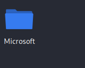

Inside the `Microsoft` folder was:

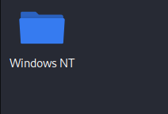

Inside the `Windows NT` folder was:

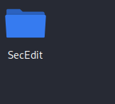

Inside the `SecEdit` folder was:

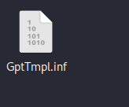

`GptTmpl.inf` contained:

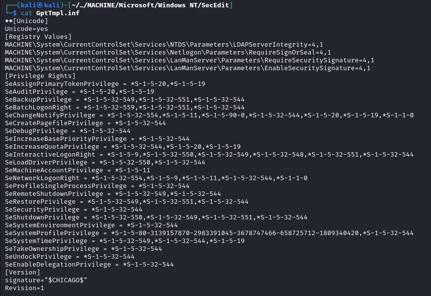

I then returned to the main `Policies` folder and decided to explore the contents of `{31B2F340-016D-11D2-945F-00C04FB984F9}`:

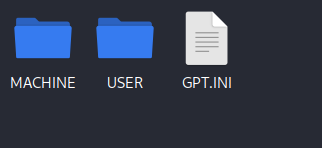

`GPT.INI` contained:

```txt
[General]
Version=52
```

While the `USER` folder contained:


The `MACHINE` folder contained:

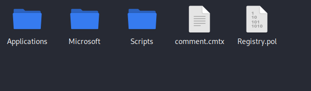

`Registry.pol` contained:

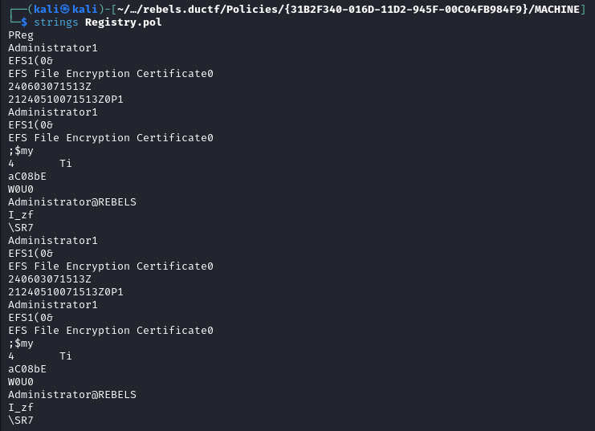

`comment.cmtx` contained:

```txt
<?xml version='1.0' encoding='utf-8'?>
<policyComments xmlns:xsd="http://www.w3.org/2001/XMLSchema" xmlns:xsi="http://www.w3.org/2001/XMLSchema-instance" revision="1.0" schemaVersion="1.0" xmlns="http://www.microsoft.com/GroupPolicy/CommentDefinitions">
  <policyNamespaces>
    <using prefix="ns0" namespace="Microsoft.Policies.PowerShell"></using>
  </policyNamespaces>
  <comments>
    <admTemplate></admTemplate>
  </comments>
  <resources minRequiredRevision="1.0">
    <stringTable></stringTable>
  </resources>
</policyComments>
```

The `Scripts` folder contained:

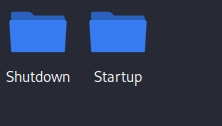

Inside the `Startup` folder was:


Inside the `Shutdown` folder was:


I then went back to the `MACHINE` folder, and checked the `Microsoft` folder:

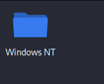

The `Windows NT` folder contained:

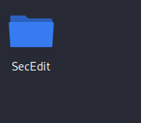

The `SecEdit` folder contained:

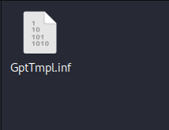

`GptTmpl.inf` contained:

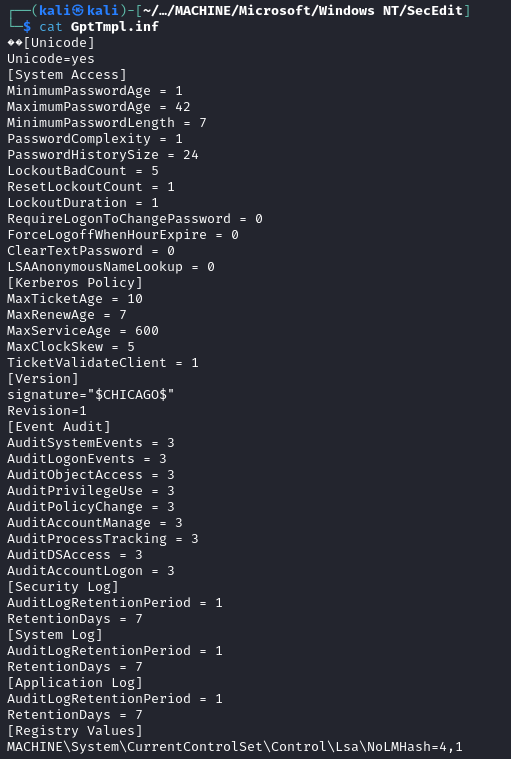

I then navigated back to the `MACHINE` folder, and looked inside the `Applications` folder:


I then returned to the main `Policies` folder and decided to check the contents of `{B6EF39A3-E84F-4C1D-A032-00F042BE99B5}`:

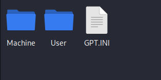

`GPT.INI` contained:

```txt
[General]
Version=10
displayName=New Group Policy Object
```

The `User` folder contained:


While the `MACHINE` folder contained:

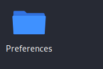

I looked inside the `Preferences` folder:

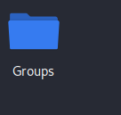

The `Groups` folder contained:

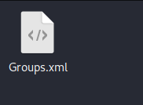

`Groups.xml` contained:

`<?xml version="1.0" encoding="utf-8"?>
<Groups clsid="{3125E937-EB16-4b4c-9934-544FC6D24D26}"><User clsid="{DF5F1855-51E5-4d24-8B1A-D9BDE98BA1D1}" name="Backup" image="2" changed="2024-06-12 14:26:50" uid="{CE475804-94EA-4C12-8B2E-2B3FFF1A05C4}"><Properties action="U" newName="" fullName="" description="" cpassword="B+iL/dnbBHSlVf66R8HOuAiGHAtFOVLZwXu0FYf+jQ6553UUgGNwSZucgdz98klzBuFqKtTpO1bRZIsrF8b4Hu5n6KccA7SBWlbLBWnLXAkPquHFwdC70HXBcRlz38q2" changeLogon="0" noChange="1" neverExpires="1" acctDisabled="0" userName="Backup"/></User>
</Groups>
`

`cpassword` caught my eye, so I decided to research it. I searched `cpassword` on Google and came across this article from `sdmsoftware.com`

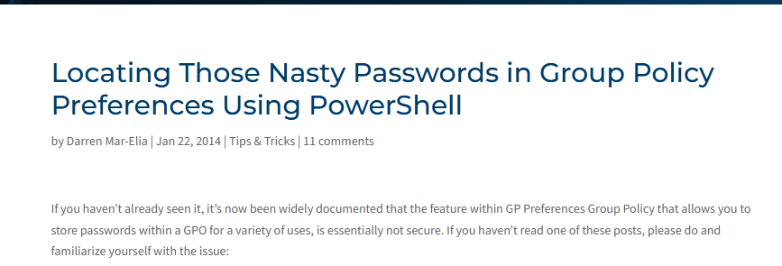

I then searched for a tool to crack cpassword, and found gpp-decrypt on Github, made by `SixArm`. I installed it on my machine and typed:

```txt
python3 gpp-decrypt.py -f Groups.xml
```

The `-f` flag specifies the file to be decrypted, in this case, `Groups.xml`. I then executed the command, which resulted in:

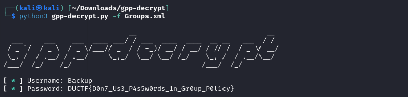

I then submitted `DUCTF{D0n7_Us3_P4s5w0rds_1n_Gr0up_P0l1cy}` and solved the challenge.
