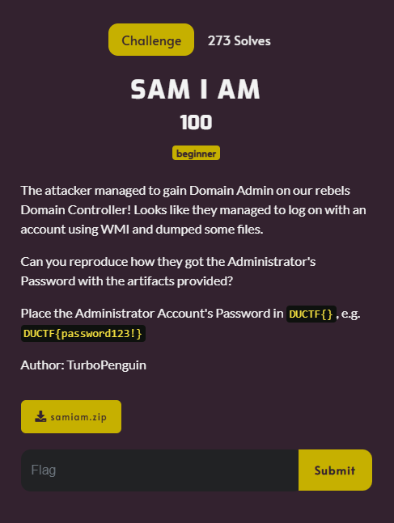
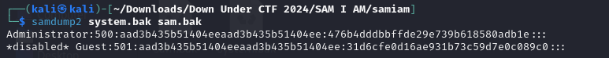
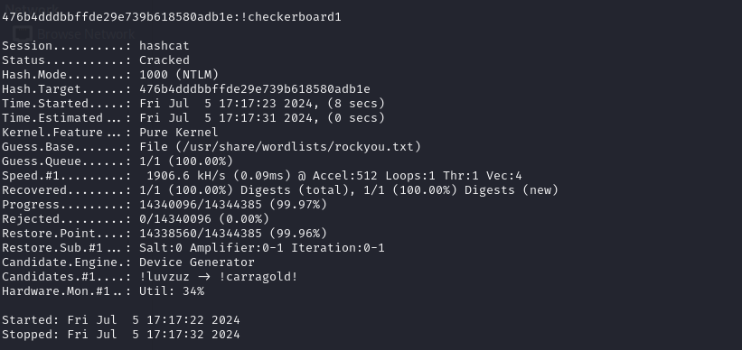

# SAM I AM



I downloaded `samiam.zip` and placed it on my Kali Linux VM. From there, I unzipped it, which revealed that `samiam.zip` contained 2 files: sam.bak and system.bak. Junior Crypt 2024 had a lot of SAM file challenges, so I knew what I had to do. So I typed:

```txt
samdump2 system.bak sam.balk
```

`samdump2` is used to extract password hashes from a SAM database using a SYSTEM file for decryption, outputting the hashed passwords. `system.bak` contains the system key for decryption of the SAM database `sam.bak`. I then executed the command, which resulted in:



From the Series SAM challenge in Junior Crypt 2024 ([here's my writeup](https://github.com/marcoparello/CTF-Writeups/blob/main/Junior-Crypt-2024/forensics/Series-SAM.md)), I know that the password hash is `476b4dddbbffde29e739b618580adb1e`, is the password hash. Since the hash came from a SAM file, it is of the NTLM type. In order to crack the hash, I decided to use hashcat. I typed:

```txt
hashcat -m 1000  476b4dddbbffde29e739b618580adb1e -w /usr/share/wordlists/rockyou.txt
```

In hashcat, the 1000 value for the `-m` flag corresponds to NTLM hashes. I then executed the command, which resulted in:



I then submitted `DUCTF{!checkerboard1}` and solved the challenge.
