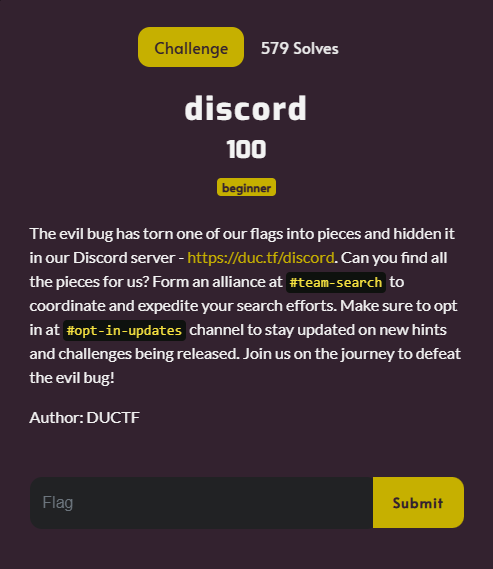
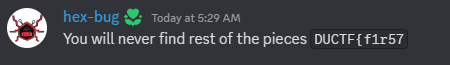
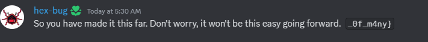

# discord

I clicked on the link to join the discord server, and then navigated to #team-search, as specified in the description. Once there, I found:

With the first part of the flag found, I proceeded to navigate to #opt-in-updates, as hinted in the description of the challenge. Once there, I found:

I then submitted `DUCTF{f1r57_0f_m4ny}` and solved the challenge.
