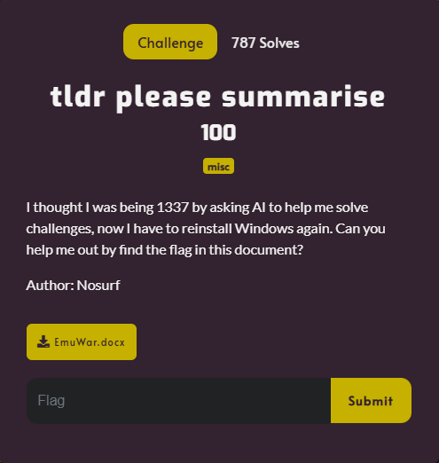

# tldr please summarise



I downloaded `EmuWar.docx` and opened it in Word, which revealed it's text:

```txt
The Emu War of 1932 stands as a curious and often overlooked event in Australian military history. Though brief in duration and seemingly inconsequential in its outcome, this conflict between the Australian military and a population of emus in the Wheat Belt region of Western Australia offers valuable insights into the complexities of human-wildlife interactions and the challenges of managing natural resources. In this essay, we will explore the Emu War in detail, examining its historical context, the events leading up to the conflict, the military intervention, its outcomes, and the lasting implications for both humans and emus alike.

Historical Context

To understand the Emu War, one must first consider the broader historical context in which it occurred. The early 20th century was a period of significant social, economic, and environmental change in Australia. Following World War I, returning soldiers sought opportunities for settlement and employment, leading to the expansion of agricultural activities in regions such as the Wheat Belt.
The Wheat Belt, characterized by its vast expanses of arable land, became a focal point for agricultural development, with farmers cultivating crops such as wheat, barley, and oats. However, this expansion brought with it new challenges, including conflicts with native wildlife species such as the emu.

Emergence of the Emu Problem

Emus, large flightless birds native to Australia, have long inhabited the continent's interior regions. With their formidable size, strength, and agility, emus are well-adapted to the harsh and often unforgiving conditions of the Australian outback. However, their presence in agricultural areas posed a significant threat to farmers' livelihoods.
As farms expanded into previously uninhabited territories, emus began to encroach upon cultivated fields, where they found an abundant food source in the form of crops such as wheat and barley. Flocks of emus would descend upon the fields, trampling crops, devouring seedlings, and causing extensive damage.

Farmer's Appeal and Government Response

Faced with mounting losses and growing frustration, the farmers of the Wheat Belt turned to the government for assistance. In response to their pleas, the Minister of Defence, Sir George Pearce, authorized a military intervention to address the emu problem. The task of leading this operation fell to Major G.P.W. Meredith, a seasoned military officer with experience in logistics and strategy.
The government's decision to deploy the military against the emus reflected the seriousness of the situation and the perceived threat to agricultural productivity. The goal of the intervention was clear: to protect the farmers' crops and restore order to the affected regions.

Military Intervention

Armed with two Lewis guns and a contingent of soldiers, Major Meredith set out to confront the emu threat head-on. The plan was straightforward: use the firepower of the machine guns to cull the emu population and thereby mitigate the damage to agricultural interests.
The military intervention began in early November 1932, with the soldiers deployed to strategic locations in the Wheat Belt where emu activity was most prevalent. Initially, the operation appeared to proceed according to plan, with the soldiers effectively targeting emu flocks and inflicting significant casualties.
However, it soon became apparent that the emus were not as easily deterred as initially anticipated. Far from being simple-minded and disorganized, the emus demonstrated remarkable intelligence and adaptability in the face of the military threat.

Emu Tactics and Countermeasures

As the soldiers attempted to engage the emus, they found themselves facing a formidable adversary. Emus, with their keen senses and instinctual knowledge of the land, quickly adapted to the tactics employed by the military.
Rather than engaging in direct confrontations, the emus employed hit-and-run tactics, utilizing their speed and agility to evade the soldiers' gunfire. Flocks of emus would split into smaller groups, making it difficult for the soldiers to concentrate their fire and inflict significant casualties.
Moreover, the emus exhibited a degree of coordination and organization that belied their reputation as simple-minded animals. They communicated with each other through vocalizations and body language, signaling danger and coordinating their movements to outmaneuver the soldiers.

Military Challenges and Setbacks

As the operation progressed, the soldiers encountered numerous challenges and setbacks. The rugged terrain of the Australian outback, combined with adverse weather conditions, made it difficult to maintain effective control over the battlefield.
Logistical issues such as limited ammunition supplies and mechanical failures further hampered the military's efforts. Emus, with their intimate knowledge of the land, exploited these vulnerabilities, launching attacks on supply lines and disrupting communication networks.
Despite their best efforts, the soldiers struggled to gain the upper hand in the conflict. The emus, with their superior numbers and tactical acumen, continued to pose a significant threat to the military's objectives.

Public Perception and Political Fallout

The Emu War attracted widespread media attention and public interest, with newspapers running sensational headlines about the bizarre conflict. However, the public's perception of the war was largely divided along partisan lines.
Supporters of the military intervention saw it as a necessary and justified response to a legitimate threat to agricultural interests. They praised the government's decisive action in addressing the emu problem and restoring order to the affected regions.
Critics, on the other hand, derided the government's handling of the situation, questioning the wisdom of deploying the military against a population of birds. They viewed the Emu War as a farcical and misguided endeavor, highlighting the absurdity of using taxpayer funds to wage war on wildlife.

Resolution and Aftermath

In early December 1932, faced with mounting criticism and diminishing prospects of success, the government decided to withdraw its forces from the conflict. The Emu War officially ended, with the soldiers returning to their barracks and the farmers left to devise their own strategies for dealing with the persistent emu problem.
In the aftermath of the conflict, various proposals were put forward to address the emu issue, including bounty schemes and the construction of emu-proof fences. However, none proved to be entirely effective, and emus continued to pose a threat to agricultural interests in the Wheat Belt and other regions of Australia.

Legacy of the Emu War

Despite its relatively short duration and limited scope, the Emu War has left a lasting legacy in the annals of Australian history. It serves as a cautionary tale about the complexities of human-wildlife interactions and the unintended consequences of military intervention in such matters.
The Emu War also highlights the remarkable adaptability and intelligence of emus, challenging conventional notions of their behavior and capabilities. Far from being simple-minded and disorganized, emus demonstrated a degree of cunning and organization that surprised even seasoned military officers.
In popular culture, the Emu War has inspired numerous artistic interpretations, including books, films, and even a musical. It continues to captivate the imagination of people around the world, serving as a reminder of the strange and unpredictable ways in which humans interact with the natural world.

Conclusion

In conclusion, the Emu War of 1932 remains a fascinating and often misunderstood chapter in Australian history. Though it may have ended without a clear victor, its legacy endures as a testament to the resilience of emus and the challenges of managing human-wildlife conflicts.
As we reflect on the events of the Emu War, we are reminded of the importance of understanding and respecting the natural world. Rather than resorting to military force, perhaps the true solution to conflicts such as these lies in finding sustainable and humane ways to coexist with the wildlife that shares our planet.
```

While reading the document, I noticed something strange:


I wondered why word highlighted the blank space with errors? So I copied and pasted the blank space into my browser, which revealed:


I then entered `https://pastebin.com/raw/ysYcKmbu` in my browser, which took me to this page:


The original command piped a Base64 decode (`| base64 -d`), so I used `cyberchef.com` to decode the Base64 encoded text, which resulted in:


I then submitted `DUCTF{chatgpt_I_n33d_2_3scap3}` and solved the challenge.


