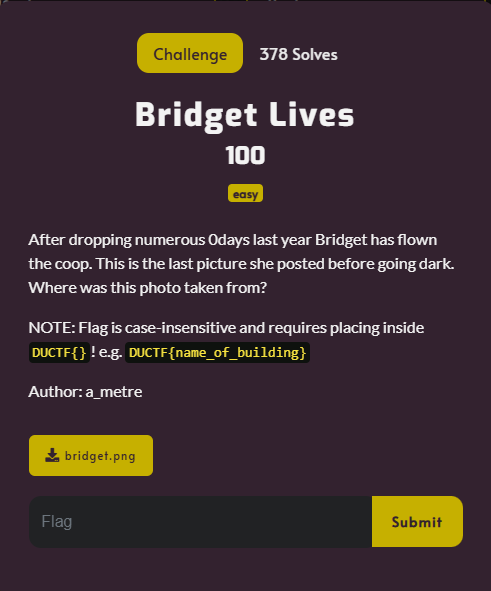
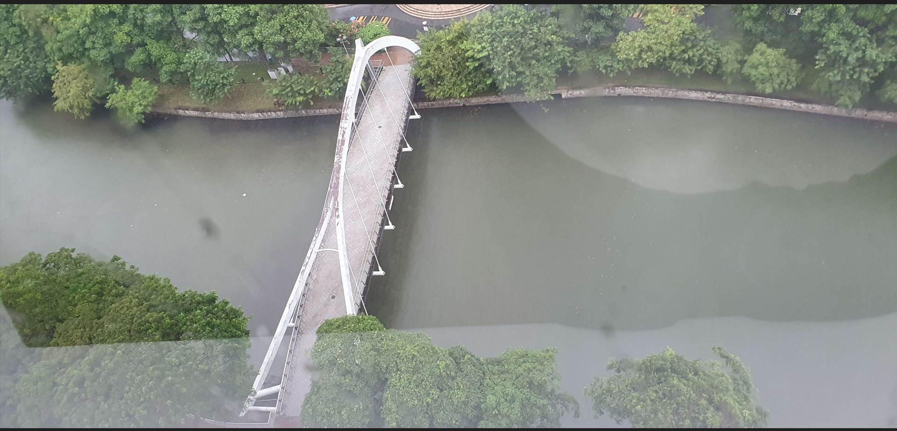

# Bridget Lives

I downloaded `bridget.png` onto my Kali Linux VM and opened it:

I then used Google's reverse image search on the image, which resulted in:

That Tripadvisor picture is seemed very similar to `bridget.png`, so I clicked on the link, which took me to the Tripadvisor page:

I then put the address into Google Earth and “walked” on the bridge. The Google Earth data was from 2018, but had the same 3 boxes on the left as the original photo:

Seen here:

Therefore, the bridge from the Tripadvisor posting was the same as the bridge in `bridget.png`. I then went back to the Tripadvisor page in order get the name of the building that the photo was taken from:

Using the challenge description, I submitted `DUCTF{four_points_by_sheraton_singapore}` and solved the challenge.

