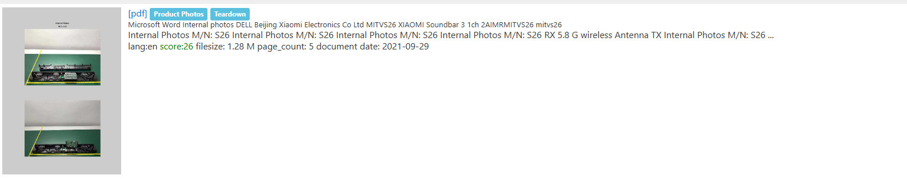

# Sounds Nice

I downloaded `soundsystem.jpeg` onto my Kali Linux VM and opened it:

I first need to find the model of the sound system, as without the name of the model I can't answer any of the questions. So, I used Google's reverse image search:

I then clicked on the Walmart link:

I then searched `Xiaomi Soundbar 3.1 Manual` and found it’s manual page from `manualslib.com`. I then navigated to the `Specifications` part of the manual, which revealed:

Now knowing the name of the model, I searched `Xiaomi S26 internal photos`, which led me to `device.report.com`:

Where I found a teardown of the S26:

Looking through the photos I found:

I then searched `ATS2853` on Google, which returned that it was a Bluetooth chipset, answering the question of `Which bluetooth chipset is used?`. I now needed to find the answer to `What is wireless audio chipset used?`. So, I proceeded to look through more of the internal photos, and came across:

I made out the words ETK51 from the image, but I wasn't sure if I was correct. So, I used Google's reverse image search to extract the text, where I noticed:

I then went to `Everstek`'s product page, where I found:

At least I now knew the name of the wireless module, but I still didn't know the name of the main chip. So I searched:

Where I found this document from `fcc-id.com`, titled:

I then opened the document, where I found:

Now knowing that the answer to `What is wireless audio chipset used?` was ETK51, I needed to find the answer to `What is the value of the coupling capacitor, connected to the audio module's RX antenna?`. So, I continued to look through the document, and came across:

 

 I then followed the path from where RFN_RX and RFP_RX (the two components of the RX antenna) intersected:

 

 Which revealed:

 

Now knowing that the answer to `What is the value of the coupling capacitor, connected to the audio module's RX antenna?` was 9, I just needed to find `What is the pin number on the wireless audio chipset for the I2C clock signal?`. So, I looked at the diagram of the main chip:

I then looked at the table for the main chip:

I noticed:

So, I looked at the diagram of the main chip to find the pin number of `P0.0_I2C_SCL`, where I found:

Therefore, the answer to `What is the pin number on the wireless audio chipset for the I2C clock signal?` is 31. Now having answered all of the questions, I submitted `DUCTF{ATS2853_ETK51_9_31}` and solved the challenge.

With the challenge solved, I had solved all of the OSINT challenges in this CTF, which is the first time I have ever completed all of the challenges in a category in a CTF:

 

