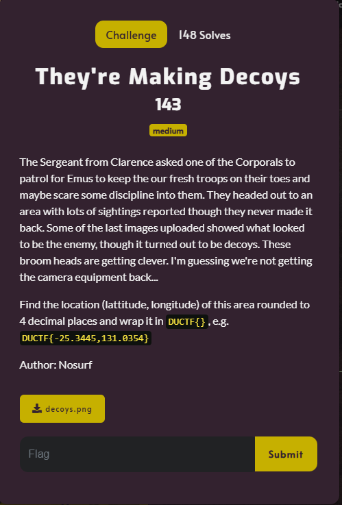
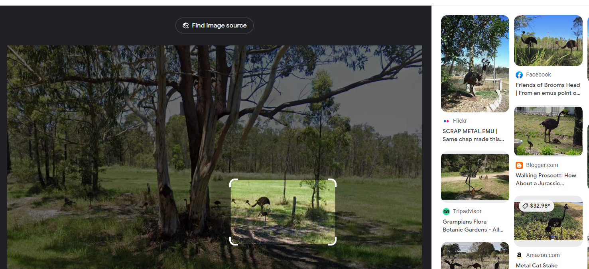
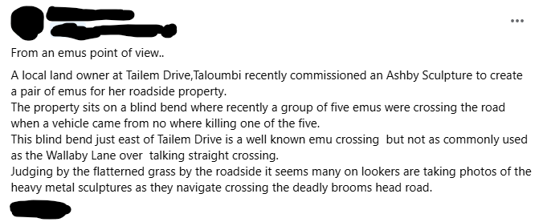
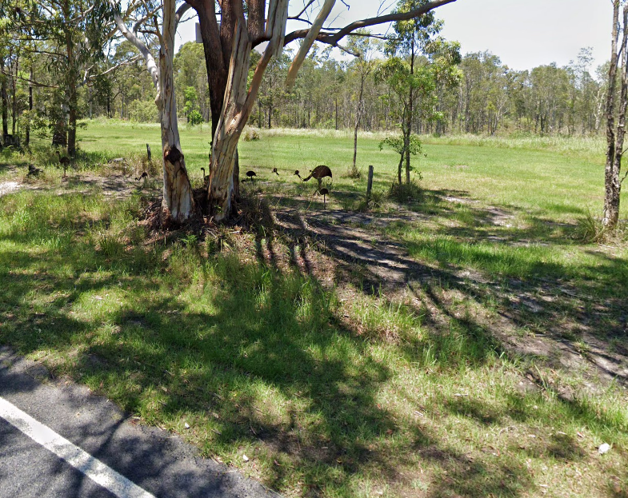

# They're Making Decoys

I downloaded `decoys.png` onto my Kali Linux VM and opened it:

I then uploaded the image to Google's reverse image search, focusing on the decoy emu's:

The Facebook post seemed interesting, so I clicked on it:

I then searched `Tailem Drive, Taloumbi` on Google Earth, and "walked" around a bit before I came across:

With the URL containing the coordinates:

Using the challenge description, I submitted `DUCTF{-29.5506,153.2777}` and solved the challenge.
