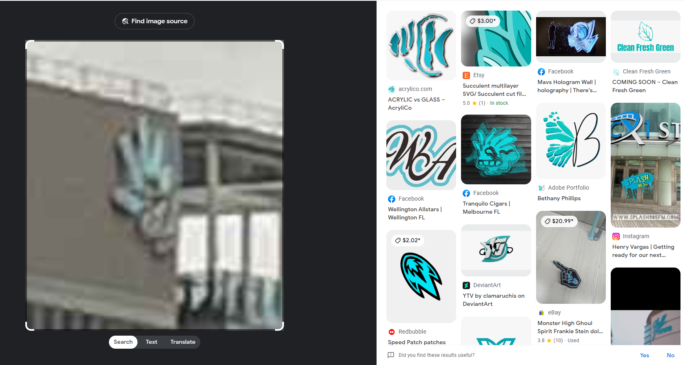

# cityviews

I downloaded `cityviews.jpeg` and opened it on my Kali Linux VM:

I then ran `exiftool`, but it didn’t return any coordinates. So, I then used `GeoSpy Ai`:

I then clicked on the `View on Google Maps` button, which resulted in:

Yeah that's not correct. I then decided to take a closer look at the image, focusing on this sign:

The sign says `3AW Melbourne`, which means that the image was taken somewhere in Melbourne. I then foucused on this interesting logo:

However, it was so pixelated that when I tried to use Google’s reverse image search, the results were useless:

I then used the program `upscayl` to upscale the original image in the hopes that reverse image search would hopefully return more relevant results. I upscaled the image by a factor of 3x and used the Real-Esergan-Fast preset. After the image was was upscaled, I cropped it:

It's a messy upscale (which makes sense as the logo is very small in the original photo), but hopefully it works. I then used Google's reverse image search on the upscaled image, which returned:

That Linkedin post seemed to have a very similar building (I blocked at the name of the author for privacy), so I navigated to the Linkedin post, and found that the author worked at:

I then searched:

I then went to the address on Google Earth, and “walked” around for a bit. While walking, I came across this building:

Those letters seem to be the same letters as this from the original photo:

This tree must have blocked the sign in the original photo:

I then found the name of the building in front of The Great Southern Hotel:

Using the challenge description, I submitted  `DUCTF{hotel_indigo_melbourne}` and solved the challenge.

