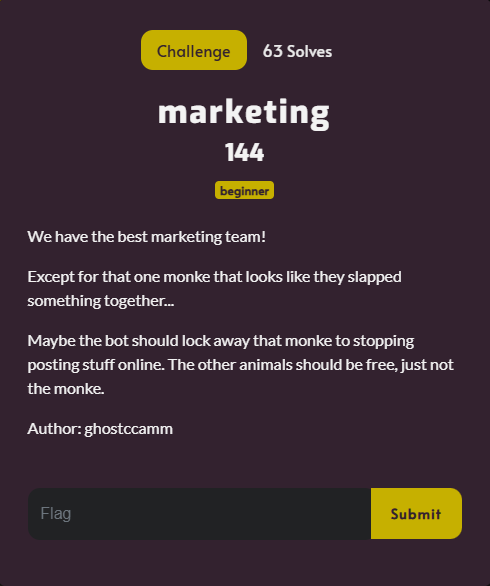

# marketing

Since the challenge description mentioned `posting stuff online`, I looked up:

In the results of the search there was a link to the `DownUnderCtf` `x.com` page. I scrolled through the page, until I came across this post:

I watched the video a couple of times, but couldn’t find a flag. The next day, I watched the video again, not expecting to find a flag. However, at the time stamp of 00:13, I noticed:

Here’s a closer look:

The flag was in plain sight the whole time. I submitted `DUCTF{doing_a_bit_of_marketing}` and solved the challenge.
