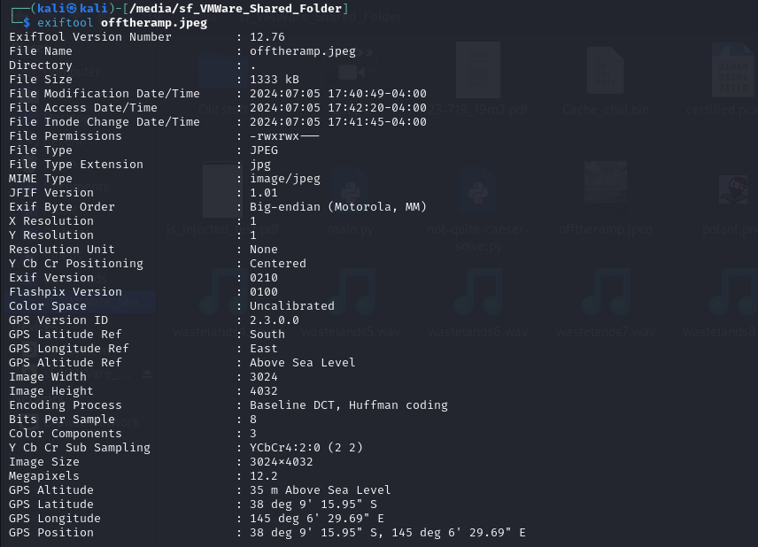

# offtheramp


I downloaded `offtheramp.jpeg` onto my Kali Linux VM, and opened it with the image viewer: 


A good rule of thumb when attempting OSINT challenges is to use `exiftool`, as sometimes the images still contain the coordinates of where they were taken. So I typed:

```txt
exiftool offtheramp.jpeg
```

Which resulted in:



Now knowing where the image was taken, I entered the coordinates onto Google Maps, which resulted in:


I then clicked on `Cripps Family Fish & Chips`, as I was 99% sure that the name of the ramp wasn’t `Cripps Family Fish & Chips`. Maybe the store would have the name of the ramp in it’s address?


I was correct. The name of the dock was `Olivers Hill Boat Ramp`. Therefore, using the challenge description, I submitted `DUCTF{olivers_hill_boat_ramp}` and solved the challenge.
