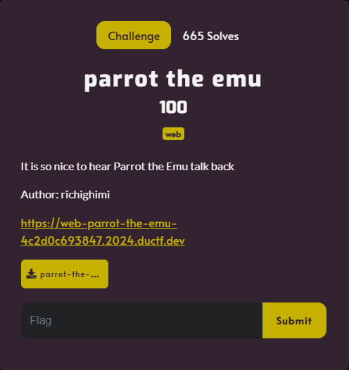
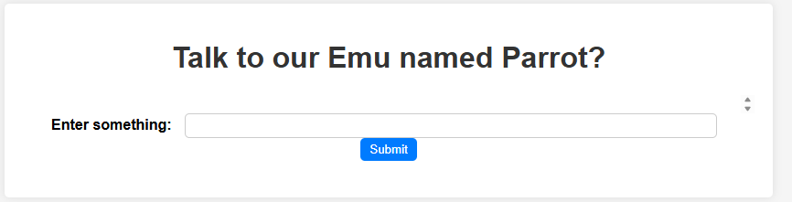
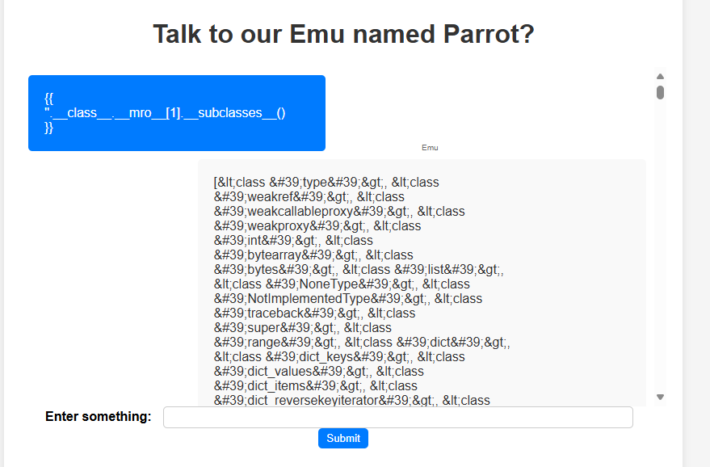
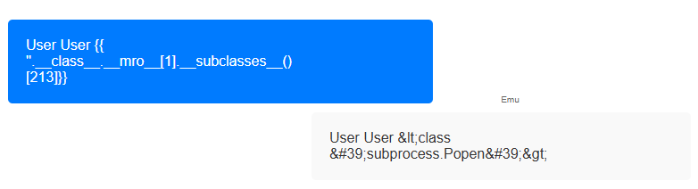

# parrot the emu



I clicked on the link and it takes me to this webpage:



I entered `a`, and the emu responded `a`. Since the challenge provides a file titled `parrot-the-emu.zip`, I download the file onto my Kali Linux VM and unzip it. I open up the unzipped folder, which reveals it's contents: a folder titled `static`, a folder titled `templates`, a python file named `app.py`, a file named `flag`, and a text file titled `requirements.txt`. I can already tell that because the provided file has a file named `flag`, the server must also. Therefore I must somehow exploit a vulnerability that would allow me to acess the `flag` file on the server. I then decided to look inside `app.py`, which contains:

```txt
from flask import Flask, render_template, request, render_template_string

app = Flask(__name__)

@app.route('/', methods=['GET', 'POST'])
def vulnerable():
    chat_log = []

    if request.method == 'POST':
        user_input = request.form.get('user_input')
        try:
            result = render_template_string(user_input)
        except Exception as e:
            result = str(e)

        chat_log.append(('User', user_input))
        chat_log.append(('Emu', result))
    
    return render_template('index.html', chat_log=chat_log)

if __name__ == '__main__':
    app.run(debug=True, port=80)
```

This particular section was very interesting:

```txt
result = render_template_string(user_input)      
```

There is the vulnerablity I need to exploit. Because the user input is directly rendered as a template, a Server-Side Template Injection (SSTI) is present. Through the useage of template syntax ({{ }}, { }, #{ }, etc), an attacker could inject code that access server-side variables, functions, and execute arbitrary Python code. Now knowing the vulnerability, I entered 

```txt
{{“.___class___.___mro___[1].___subclasses__()}}
```

Into the `Enter something:` box on the website. The code lists all the python subclasses on the server. I clicked on `Submit`, which resulted in:



It was a long list, but I just needed to get an index number of the subclass that would allow me to execute commands on the server. So, I inserted a payload in Burp Intruder to cycle all the index numbers from 1-300 (arbitrarily picked), and executed it. I mostly got errors, until the 213th index number:


