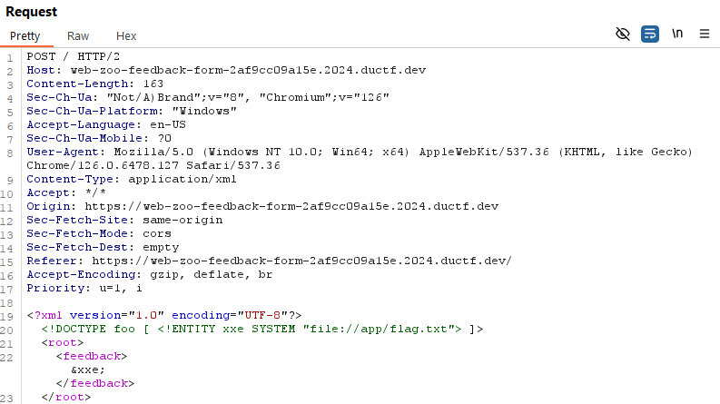

# zoo feedback form


I click on the link, which takes me to this webpage:


How nice of the zoo to allow feedback. I always love when companies allow for feedback. Might as well type something. Why not “a”? It’s a really thoughtful and well written feedback for the zoo:


I hope the Emus know English. Since this is a web challenge, I opened up the request in Burpsuite:


The feedback form uses XML to process the feedback. XML is basically HTML but without the predefined tags. Because the XML is rendered in the request, not the response, I inserted:


Which is an XXE attack. The `DOCTYPE foo` declares the document type definition of the XML (basically the structure), named foo. The `ENTITY xxe` declares an external entity named xxe. The `SYSTEM file:///etc/passwd>`  specifies that `xxe`’s value is located at `file:///etc/passwd`. Any mention of xxe in the XML will be replaced with the value of `file:///etc/passwd`.  Finally, the `&xxe` mentions ` xxe, so when the request is sent, the feedback will be changed from `&xxe` to whatever the value that resides with `file:///etc/passwd` is. So, I send the request, which results in:


Which confirms that the web page is vulnerable to XXE attacks. Now I just need to leverage the vulnerability to access the flag. I downloaded `zoo-feedback-form.zip` onto my Kali Linux VM and unzipped it, which revealed it's contents: a folder titled `main-app`, a dockerfile titled `Dockerfile`, and a text document titled `requirements.txt`. The `main-app` folder contained: a folder titled `static`, a folder titled `templates`, a python file titled `app.py`, and a text file named `flag.txt`. I then back and examined the contents of `Dockerfile`:

```txt
FROM python:3.9-slim

WORKDIR /app

COPY requirements.txt .

RUN pip install -r requirements.txt

COPY main-app/ .

EXPOSE 80

CMD [ "python", "app.py" ]
```

The working directory of the server is /app, as established by the WORKDIR. Therefore, I modified the request in Burpsuite to be:



Which is very similar to my previous input, but instead of accessing `/etc/passwd`, it instead accesses `/app/flag.txt`. I then sent the request, which resulted in:


I then submitted `DUCTF{emU_say$_he!!0_h0!@_ci@0}` and solved the challenge.
