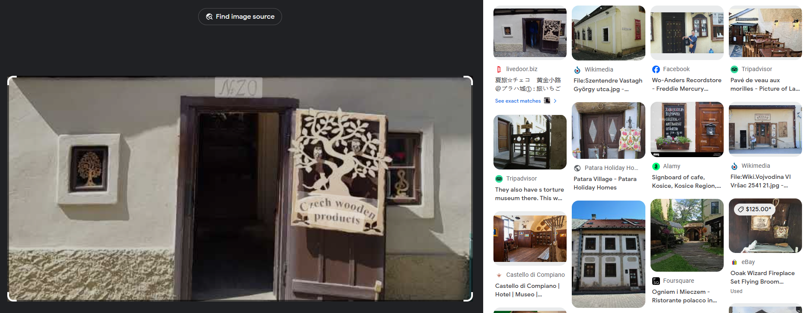

# czech where?
Given this image:


Find what street it is on.

I first used google reverse image search, which gave me:



The result on the top left looks very similar to the image. Almost exactly. I then clicked on the image, which led to a blog, that mentioned:


On the blog it says that the name of the place was:


The challenge hint said to remove accent marks and that the flag would be in all lowercase letters. As English doesn't have accent marks, the flag wouldn't be `Golden Lane`. So I looked up the address for the `Golden Lane` in Czech, which gave me the name:

`zlata_ulicka_u_daliborky`

(I put underscores for the spaces and removed all of the accent marks). 

I then inputed the flag as:

```txt
irisctf{zlata_ulicka_u_daliborky}
```

I then submitted the flag, and the result was:


Done.


