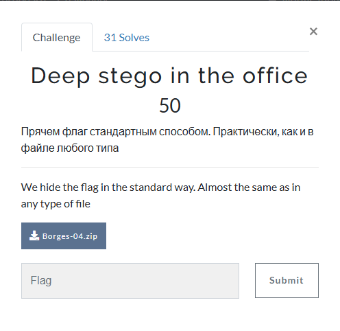
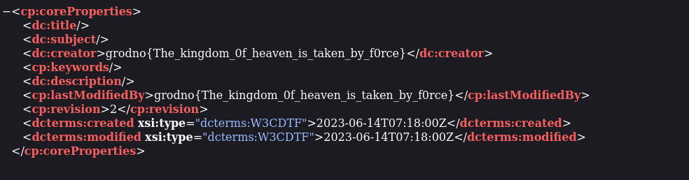

# Deep stego in the office



I download `Borges-04.zip` onto my Kali Linux VM, and unzip it. The unzipped `Borges-04.zip` contains `Borges-04.docx`. The contents of `Borges-04.docx` are:

```txt
Хорхе Луис Борхес. 
Богословы
Библиотека Максима Мошкова (http://www.lib.ru/BORHES/bogoslowy.txt)
     Перевод Е. Лысенко
     Разорив сад, осквернив чаши  и алтари, гунны верхом на лошадях ринулись
в  монастырскую библиотеку,  изорвали в  клочья непонятные для них книги и с
бранью сожгли их, видимо, опасаясь, что в буквах таятся оскорбления их Богу,
кривой железной  сабле.  Сгорели  палимпсесты и кодексы, но  внутри  костра,
среди  пепла  осталась почти невредима  двенадцатая книга  "Civitas  Dei" (О
граде  Божием), где повествуется, что Платон в Афинах  учил,  будто в  конце
веков все возродится в прежнем своем виде и он будет  здесь, в Афинах, перед
той  же аудиторией, снова  проповедовать это же учение. К пощаженному  огнем
тексту относились с особым пиететом,  и те,  кто  его  читал и перечитывал в
отдаленной этой провинции, и думать  забыли  о том,  что  автор упомянул это
учение, лишь чтобы более основательно его опровергнуть. Век спустя Аврелиан,
коадъютор  Аквилеи,  узнал,  что  на берегах  Дуная недавно  возникшая секта
"монотонов"(называвшихся также "ануляры") исповедует веру в то,  что история
- круг и нет ничего, что не существовало бы прежде и не будет существовать в
будущем. В горных областях  Колесо и  Змея вытеснили  Крест.  Страх  овладел
всеми,  но  утешением  послужил  слух,  что   Иоанн  Паннонский,  снискавший
известность   трактатом  о   седьмом  атрибуте  Бога,   готовится  сокрушить
мерзостную ересь.
     Аврелиана  эти  вести огорчили, особенно  последняя.  Он  знал,  что  в
богословских  материях  любое  новое  слово  сопряжено  с риском,  но  затем
рассудил, что тезис о круговом времени  слишком необычен, слишком удивителен
и посему риск тут невелик. (Опасаться надо тех ересей, которые можно спутать
с  ортодоксией. ) Все же ему было неприятно вмешательство - почти  наглое  -
Иоанна Паннонского. Двумя годами раньше сей муж в пространном сочинении  "De
septima  affectione  Dei  sive de  aeternitate" (О седьмой любви  Бога или о
вечности)  узурпировал тему из области Аврелиана; теперь же, словно проблема
времени была  в его  ведении,  он  собирался наставить  на  путь  истинный -
возможно, аргументами Прокруста, противоядиями пострашнее, чем сам яд  Змеи,
-  этих ануляров... В  ту ночь Аврелиан, листая древний  диалог Плутарха  об
упадке   оракулов,   обнаружил   в   29  параграфе  насмешку  над  стоиками,
предполагавшими существование  бесконечного множества миров,  с  бессчетными
солнцами, лунами, Аполлонами, Дианами  и Посейдонами. Свою  находку Аврелиан
счел счастливым предзнаменованием: он решил  опередить  Иоанна Паннонского и
сокрушить еретиков, чтящих Колесо.
     Иногда мужчина добивается любви  женщины,  чтобы  забыть  о  ней, чтобы
больше  о  ней  не  думать;  так  и  Аврелиану   хотелось  превзойти  Иоанна
Паннонского,  чтобы  избавиться от неприязни, которую  испытывал к  нему, но
отнюдь не для  того, чтобы причинить ему  зло.  Сама работа над  сочинением,
построение силлогизмов и  придумывание  едких  выпадов,  все  эти  "nego"  и
"autem" и "nequamquam" умеряли раздражение, помогали забыть о  неприязни. Он
строил длинные, запутанные периоды, загроможденные  вставными предложениями,
в которых  небрежность  слога и солецизмы были  как бы выражением презрения.
Неблагозвучность  он  сделал своим  орудием. Предвидя, что Иоанн  Паннонский
будет сокрушать  ануляров  в пророчески-торжественном тоне,  Аврелиан,  дабы
избежать  сходства,  избрал  тон  издевки. Августин писал,  что Иисус  - это
прямой путь, спасающий нас от кругов  лабиринта, в коем блуждают безбожники.
Аврелиан,  как  старательный  ученик,  сравнил  их  с  Иксионом,  с  печенью
Прометея, с Сизифом, с фиванским царем, увидевшим два солнца, с заиканием, с
белкой,  с зеркалами, с эхом,  с муллами у нории и с двурогими силлогизмами.
(Языческие  легенды  все  еще  жили,  низведенные  до  уровня стилистических
украшений. ) Подобно всякому владельцу библиотеки, Аврелиан чувствовал вину,
что не знает ее всю; это противоречивое чувство побудило его воспользоваться
многими книгами, как бы таившими  упрек в невнимании. Так, он сумел вставить
пассаж из  "De principiis" (О началах)  Оригена, опровергающий мнение, будто
Иуда  Искариот снова  предаст  господа, а  Павел будет  в  Иерусалиме  снова
присутствовать  при мученической  гибели  Стефана,  и  еще другой пассаж  из
"Academica  priora"  (Первые  Академики)  Цицерона,   где   высмеяны   люди,
воображающие, будто в то время, когда  он беседует  с  Лукуллом, бесконечное
множество других Лукуллов и других Цицеронов  говорят в точности то же самое
в  бесчисленных  мирах,  подобных  нашему.  Вдобавок   Аврелиан  обрушил  на
монотонов упомянутый текст Плутарха и свое негодование по поводу того,  что,
мол, на язычника lumen  naturae (свет природы) оказал большее действие,  чем
на них  слово божье. Труд этот занял у  него девять дней, а  на  десятый ему
вручили перевод опровержения, сочиненного Иоанном Паннонским.
     Оно было смехотворно  кратким - Аврелиан взглянул на него с презрением,
а  затем со страхом.  В  первой  части содержалось толкование заключительных
стихов девятой главы Послания к евреям, где  сказано, что Иисус  не приносил
себя в жертву многократно  от начала мира,  но совершил это  однажды к концу
веков.  Во  второй  части  было  приведено библейское  упоминание  о тщетном
многословии язычников (Матфей VI, 7) и то место из седьмой книги Плиния, где
говорится, что во всей Вселенной не найти двух одинаковых лиц. Точно так же,
заявлял Иоанн Паннонский,  не найти и двух одинаковых  душ, и самый  гнусный
грешник столь же драгоценен,  как кровь, ради него пролитая Иисусом Христом.
Поступок одного  человека, утверждал он, имеет больше  веса, чем  все девять
концентрических небес,  и  воображать,  будто  он может  исчезнуть,  а потом
возникнуть  снова,  -   значит  проявить  вопиющее  легкомыслие.  Время   не
восстанавливает то,  что  мы  утратили:  вечность  хранит это  для  райского
блаженства, но также для огня адова. Трактат был написан ясно и всеобъемлюще
- казалось, он сочинен не конкретной личностью, но как бы "всяким человеком"
или - может быть - всем человечеством.
     Аврелиан  испытал   острое,  почти  физическое  чувство  унижения.  Ему
захотелось   уничтожить  или  переделать  свой  труд,  но  затем,   движимый
обозленной  честностью,  он  отправил его в Рим  не изменив ни одной  буквы.
Несколько месяцев  спустя, когда  собрался  Пергамский  собор,  опровергнуть
заблуждения монотонов поручили (как и следовало ожидать) Иоанну Паннонскому;
его ученого, сдержанного  по тону опровержения  оказалось  достаточно, чтобы
ересиарха  Эвфорбия осудили на сожжение. "Это  уже происходило  и произойдет
снова, - сказал Эвфорбий. - Вы  возжигаете не костер,  но огненный лабиринт.
Если  бы  здесь  соединились  все костры,  на которые  я  восходил,  они  не
уместились бы на земле,  и ангелы ослепли бы. И это я говорил неоднократно".
Потом он стал кричать, потому что огонь добрался до него.
     Колесо  пало,  побежденное Крестом (В рунических крестах  переплетены и
сочетаются оба  враждебных символа -  прим. автора), однако Аврелиан и Иоанн
продолжали свою тайную  войну.  Оба  сражались в  одном и  том же стане, оба
жаждали  той  же награды, воевали  против  того же врага, но Аврелиан не мог
написать ни слова, за которым не таилось бы безотчетное стремление превзойти
Иоанна. Его  страдания оставались невидимы - если тексты меня не обманывают,
имя "другого" ни разу не  появляется во многих томах Аврелиана, собранных  в
"Патрологии" Миня. (От сочинений Иоанна дошли всего-навсего двадцать слов. )
Оба не одобряли  анафем, провозглашенных вторым Константинопольским собором,
оба осуждали ариан, отрицавших божественную сущность Сына, оба  подтверждали
ортодоксальность "Христианской топографии" Косьмы, который учит, что  земля,
подобно еврейской скинии, имеет  форму  четырехугольника. На беду,  во  всех
четырех углах  земли объявилась другая,  бурно ширившаяся ересь. Родившись в
Египте или Азии  (свидетельства  тут расходятся, и  Буссе не  желает принять
доводы  Гарнака), она заразила восточные провинции и воздвигла свои капища в
Македонии, в Карфагене и в Трире. Казалось,  она свирепствует повсеместно, -
говорили, что  в Британском епископстве перевернули распятия вверх ногами, а
в Цезарее образ Господа заменили зеркалом.  Эмблемами новых схизматиков были
зеркало и обол.
     Истории они известны под разными именами (спекуляры, абисмалы, каиниты)
но самым общепринятым было "гистрионы", данное им Аврелианом и дерзостно ими
подхваченное. Во Фригии их называли "симулякры", так  же и в Дардании, Иоанн
Дамаскин именовал их  "формы" -  тут  следует заметить,  что этот пассаж  не
признан Эрфьордом. Нет такого ересеведа,  который бы с изумлением не сообщал
об  их  чудовищных  обычаях.  Многие  гистрионы   проповедовали  аскетизм  -
некоторые увечили себя, подобно Оригену, другие жили  под землею, в клоаках,
иные вырывали себе  глаза; иные ("навуходоносоры" из Нитрии) "ели траву, как
волы,  и волосы  выросли  у  них,  как  у  орла".  От  умерщвления  плоти  и
самоистязания они  нередко переходили к преступлению,  в  некоторых  общинах
процветало  воровство, в  иных  убийство, в иных  содомия,  кровосмешение  и
скотоложство. Все  они были  богохульники, поносили не  только христианского
Бога,  но  даже таинственных богов своего  пантеона.  Они сочиняли священные
книги, утрату которых  оплакивают ученые.  Сэр Томас Браун  писал около 1658
года:  "Время   уничтожило  горделивые  гистрионические  Евангелия,  но   не
Оскорбления,  коим было  подвергнуто их Нечестие"; Эрфьорд предположил,  что
эти "оскорбления" (сохранившиеся в одном греческом кодексе) - они-то и  суть
утерянные  евангелия.  Это  кажется  непонятным,  если  не знать  космологию
гистрионов.
     В герметических  книгах сказано: то, что  есть внизу, подобно тому, что
есть вверху, а то, что есть вверху, подобно тому, что есть внизу; в "Зогаре"
говорится,  что  мир  нижний  -  это   отражение  мира  верхнего.  Гистрионы
основывали свое учение на извращении этой мысли. Они ссылались на Матфея VI,
12  ("Прости нам долги наши, как и  мы прощаем должникам  нашим")  и XI,  12
("Царство  небесное   силой  берется")  в   доказательствотого,   что  земля
воздействует на небо, и еще приводили из Коринфян XIII, 12 ("Теперь мы видим
как бы скозь тусклое стекло") как подтверждение того, что все нами видимое -
ложь. Возможно, под  влиянием монотонов они полагали, будто всякий человек -
это два человека, и истинный из них - тот, другой, на небе. Также воображали
они, что наши поступки  отбрасывают неистребимое обратное отражение -  стало
быть, если мы бодрствуем, тот, другой, спит; если блудим, другой целомудрен;
если  грабим, другой честен. После  смерти мы соединимся с  ним  и будем им.
(Какой-то отголосок этих учений есть у Блуа. ) Другие гистрионы считали, что
миру  придет конец, когда исчерпается  число его  возможностей, и, поскольку
повторений быть не  может, праведник  должен  исключить (то  есть совершить)
наигнуснейшие дела, дабы  таковые не  запятнали  будущего  и  дабы  ускорить
пришествие  царства   Иисусова.   Это   положение  отрицали  другие   секты,
утверждавшие, что в каждом человеке  должна совершиться история  всего мира.
Большинству, как Пифагору, надлежит пройти  через переселение в многие тела,
прежде чем они получат освобождение; другие, протеики, "за срок  одной жизни
суть львы,  драконы, кабаны,  вода и дерево". Демосфен сообщает об  очищении
грязью, которому подвергали посвящаемых в орфические мистерии; подобно этому
протеики искали  очищения злом.  Они полагали, как  Карпократ,  что никто не
выйдет из темницы, пока не отдаст последней полушки (Лука XII, 59), и обычно
обольщали кающихся еще другим стихом: "Я пришел для того,  чтоб имели жизнь,
и имели с избытком" (Иоанн XII, 10). Говорили они также, что не быть злодеем
-   сатанинская  гордыня...   Множество   разноречивых  мифологий  придумали
гистрионы:  одни призывали к аскетизму, другие к распутству, и все - смущали
умы. Теопомп, гистрион из  Береники,  отрицал все легенды: он утверждал, что
всякий человек - это орган, проецируемый божеством, дабы ощущать мир.
     Еретики  Аврелианова диоцеза  принадлежали к тем, которые заявляли, что
повторений во времени не бывает, а не к тем, которые  утверждали, что всякий
поступок отражается в небесах. Это обстоятельство было необычным,  и в одном
докладе римским властям Аврелиан о  нем упомянул. Прелат, которому отправлял
он  это донесение,  был  духовником императрицы; все знали, что трудная  его
должность   была   сопряжена   с  запретом  предаваться  интимным   радостям
спекулятивного  богословия. Но  секретарь  прелата -  прежде  коллега Иоанна
Паннонского, ныне с  ним враждовавший, - имел славу  дотошного исследователя
ересей;  Аврелиан  к  докладу  добавил   изложение  гистрионической   ереси,
встречавшейся в  маленьких монастырях  Генуи  и Аквилеи.  Написав  несколько
абзацев, он  собирался  изложить ужасный  тезис,  что  нет  двух  одинаковых
мгновений, и тут перо его остановилось. Он не мог найти нужную формулировку.
Поучения новой ереси ("Хочешь увидеть то, чего глаза человеческие не видели?
Посмотри на луну.  Хочешь услышать то,  чего  уши не слышали?  Послушай крик
птицы. Хочешь дотронуться до того, чего не трогала рука  человека?  Потрогай
землю.  Истинно  говорю,  что  Бог  еще  не  создал  мир". )  были  чересчур
напыщенными  и  метафоричными  для  пересказа.  И  вдруг в  уме его возникло
предложение из  двадцати  слов. Он радостно его  записал,  и тотчас  же  его
кольнуло подозрение,  что эта формулировка  - не  его.  На  другой  день  он
вспомнил, что прочитал ее  много лет  назад в "Adversus annulares"  ("Против
ануляров"), трактате  Иоанна Паннонского. Он  проверил цитату - да, она была
там.  Аврелианом овладели  мучительные колебания.  Изменить или  убрать  эти
слова означало  бы ослабить выразительность; оставить  их будет плагиатом  у
ненавистного  ему  человека;  указать источник  будет доносом. Он воззвал  к
небесам.   Под  вечер  следующего  дня   его   ангел-хранитель   продиктовал
компромиссное  решение. Аврелиан  те слова сохранил, но  сопроводил их таким
предуведомлением: "То, о чем нынче брешут ересиархи, дабы смутить нашу веру,
сказал в  нашем  веке  некий  ученейший  муж,  более  по недомыслию,  чем из
греховности". Потом случилось  то, чего он опасался, чего ждал, чего  нельзя
было  предотвратить.   Аврелиану  пришлось  открыть,  кто  этот  муж.  Иоанн
Паннонский был обвинен в приверженности к ереси.
     Четыре месяца спустя кузнец с Авентина, обольщенный  лживыми уверениями
гистрионов,  взвалил на плечи своему маленькому сыну  огромный железный шар,
чтобы  его  двойник  взлетел  ввысь.  Ребенок  погиб.  Ужас  вызванный  этим
претуплением, обязал  судей  Иоанна  к  неукоснительной  строгости.  Тот  не
пожелал  отречься от своих слов и повторял, что отрицание его мнения ведет к
гибельной  ереси  монотонов.  Он  не  понимал  (или не хотел  понимать), что
говорить  о  монотонах бессмысленно  - о них  давно  забыли.  С  упрямством,
отчасти старческим, он щедро приводил наиболее блестящие периоды из прежнего
своего полемического  труда,  но  судьи  даже  не слушали того,  чем некогда
восхищались.  Иоанну  следовало очистить  себя  от  малейшего  подозрения  в
гистрионизме,  а он  доказывал, что мысль, за  которую его обвиняют,  строго
ортодоксальна. Он спорил с людьми, от решения которых зависела его судьба, и
еще допустил величайшую оплошность -  спорил с  блеском и  иронией. Двадцать
шестого  октября, после обсуждения,  длившегося три  дня  и  три  ночи,  его
приговорили к смерти на костре.
     Аврелиан присутствовал при казни - отказаться означало бы признать себя
виновным.  Местом казни был холм, на зеленой вершине которого стоял  глубоко
вкопанный в землю столб, обложенный охапками дров. Чиновник прочитал решение
трибунала.  Под лучами  полуденного солнца  Иоанн  Паннонский лежал  лицом в
пыли,  издавая звериный вой.  Он цеплялся за землю, но  палачи схватили его,
раздели и  наконец привязали к столбу. На голову ему одели пропитанный серой
венок из  соломы,  к груди привязали экземпляр  зловредной книжицы "Adversus
annulares".  Накануне   ночью  прошел   дождь,  дрова  горели  плохо.  Иоанн
Паннонский молился  по-гречески, потом на незнакомом языке. Пламя костра уже
обволакивало его, когда  Аврелиан решился поднять глаза. Огненные  языки  на
миг замерли  -  Аврелиан в  первый и последний раз  увидел лицо ненавистного
человека.  Оно  ему напомнило кого-то,  но он не мог сообразить  кого. Потом
огонь закрыл все, потом тот кричал, и казалось, будто кричит сам костер.
     Плутарх  сообщает,  что Юлий Цезарь оплакивал  гибель Помпея.  Аврелиан
гибели  Иоанна  не  оплакивал,  но  почувствовал,   что  чувствует  человек,
исцелившийся от неизлечимой болезни, ставшей частью его  жизни. В Аквилее, в
Эфесе,   в  Македонии  провел   он  долгую  череду  лет.  Он  устремлялся  к
неприветливым границам Империи,  в глухие  болота  и отшельнические пустыни,
дабы одиночество помогло ему постигнуть  его  жребий. Как-то в  мавританском
шатре, среди  ночи,  гремевшей  львиным  рыком, он  перебирал в  уме сложное
обвинение,  предъявленное  Иоанну  Паннонскому, и в энный раз  соглашался  с
приговором. Однако оправдать свой лицемерный донос было труднее. В Русаддире
он  произнес теперь уже неуместную проповедь  "Светоч светочей, возженный  в
плоти отступника". В  Гибернии, в келье  окруженного лесами монастыря, когда
ночь  близилась  к  рассвету, он вдруг  услышал шум дождя.  Ему  вспомнилась
римская ночь,  в которую он так же внезапно услышал  дробный  шум  капель. В
полдень молния  зажгла деревья, и  Аврелиан смог умереть той же смертью, что
Иоанн.
     Финал этой истории можно пересказать лишь метафорами, ибо он происходит
в царстве  небесном,  где времени не  существует.  Быть может,  следовало бы
сказать, что Аврелиан беседовал  с  Богом  и что  Бог так  мало интересуется
религиозными  спорами, что  принял его  за Иоанна  Паннонского.  Однако  это
содержало бы  намек  на возможность путаницы в  божественном  разуме. Вернее
будет сказать по иному: в раю Аврелиан узнал, что для непостижимого божества
он  и  Иоанн  Паннонский  (ортодокс  и  еретик,  ненавидящий и  ненавидимый,
обвинитель и жертва) были одной и той же личностью.
```

Since this a stego challenge, I looked up `docx stegongraphy`, which resulted in this Copilot response:


Thanks Copilot. I then extracted all the data from the docx file using:

`binwalk -e Borges-04.docx`

Which resulted in:


These files were located in a new folder that `binwalk` created, titled `_Borges-04.docx.extracted`. So, I opened `_Borges-04.docx.extracted` to view it's contents:


I then navigated to the `docProps` folder:


`app.xml` contained:


While `core.xml` contained:



I then submitted `grodno{The_kingdom_0f_heaven_is_taken_by_f0rce}` and solved the challenge.
 


