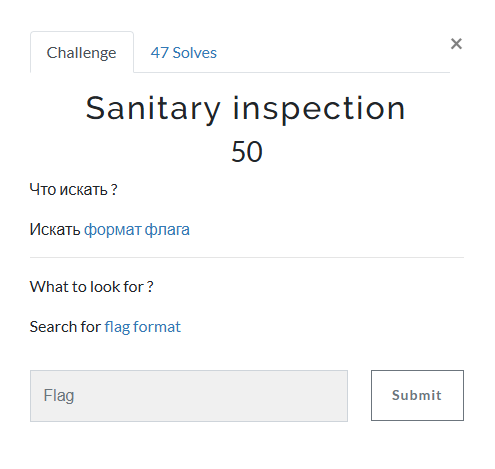
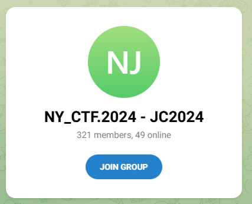
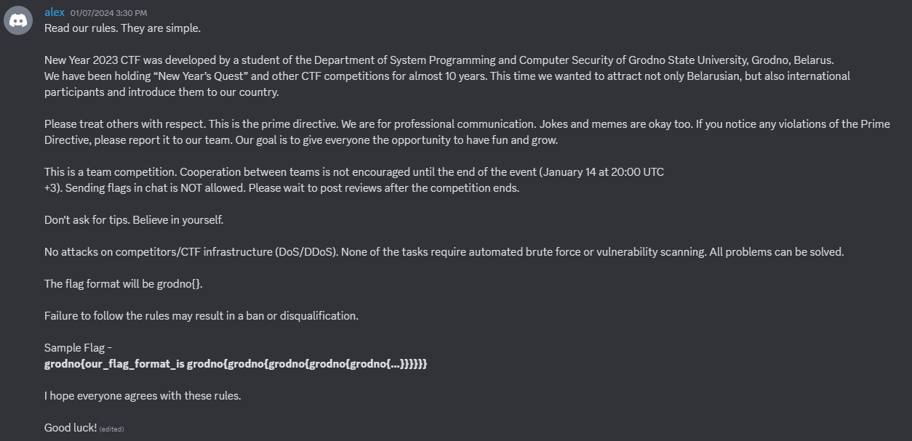

# Sanitary inspection

I click on the link, which takes me to a Telegram invite:

So, I set up a Telegram account. Once the account is set up, I accept the invite. From there, I find the Discord server invite, which I accept. Then, I navigate to the announcement channel in the Discord server, where I am greeted with:

I then submit `grodno{our_flag_format_is grodno{grodno{grodno{grodno{grodno{...}}}}}}` and solve the challenge.

