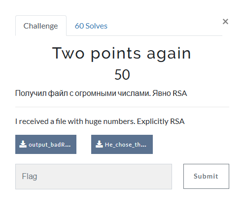

# Two points again



I download `output_badRSA1.txt` and `He_chose_the_wrong_parameters_for_RSA.jpg` onto my Kali Linux VM. `He_chose_the_wrong_parameters_for_RSA.jpg` displays:


Poor guy. While `output_badRSA1.txt` contains:

```txt
N = 894011376132861406416081994144221048298348543110763436400156707035479762291337096368301340210777912166253392435275663746074998964323198306974285233167719096055553347615918699581765041856450618725024365550285245909593290693757548300976025136185960841538482656726074757217987326418213368306947431668797511869941369363510575799319146232381645606378509284692783439527001482275434870365007864755014763434476875230779298152747668036103797086099448952638933614839186234115539057353208089196503236476069765055958643599622359809306429773621018079928117609961649006558217734057147235098517323614637509521563090769478823258676357262436290835475545437211168106617010859479612214627871047960151415095910992231687737019157788664429412462674876326653667300420128914036327499885103193423178025962079282185227746880809451234195481664650147610375976243181422075319601793906090392759832052648670731266344219250793991957964535801285606036631861341696305110038590888086491568683507575846576623827059055577036404611548224528600604898405714747157240730264673180051312634408192644777331633111950232485559076080686217541095754245034143596485147084607615402187454830802772582891800608645679493263524678084504132604846410243911260803002065871918398725293311473
e = 49999
c = 127990258916322713210704002931365496210647826869578493680557063836772515914303363145985391647430839311330158084206710072455465957218072448099969815961814463831667357474852426061475210363277306704257877402661232669936031043625938011115290529377505573367883714424182150449678726041360949463375982144652910707759221795772350872426009873120527309342093683340576731241704191541296890578962805029558926492259701366885936092059693759354255247540815813052543086204934376066884066060405947003334121725632674642690548675916126384013014552545338699198239765357561083183401525044638243204528501965028598782513999767237563252331767079569128151380305983732341553403814650118788711703476805307790685184506737890913441497269132749881622937761764492015610811577966553776703680435092016590690563200951474073620866158140866931856293211794418637441400021472249887178225738960768608549559781531479910409684884180658879621882231073123533851227894797415625533435081416099549459198508358607887551022339960981663266529984544362524495679204397590064106335341279871204905873532415276380340515150499389237587052633736125460704219829657692767592459700685070039056607335118481257774532132073976558433243315868939654221066341581052013795470559435542389710686098062
```

I looked up if the N value was factorable, which returned that it wasn't as N was a prime number. In RSA, N is supposed to be factorable. Hence `badRSA` in `output_badRSA1.txt`. So, I then crafted this ChatGPT prompt:


After I sent the prompt, this script was returned to me:

```txt
from sympy import mod_inverse

# Given prime N, public exponent e, and ciphertext c
N = 894011376132861406416081994144221048298348543110763436400156707035479762291337096368301340210777912166253392435275663746074998964323198306974285233167719096055553347615918699581765041856450618725024365550285245909593290693757548300976025136185960841538482656726074757217987326418213368306947431668797511869941369363510575799319146232381645606378509284692783439527001482275434870365007864755014763434476875230779298152747668036103797086099448952638933614839186234115539057353208089196503236476069765055958643599622359809306429773621018079928117609961649006558217734057147235098517323614637509521563090769478823258676357262436290835475545437211168106617010859479612214627871047960151415095910992231687737019157788664429412462674876326653667300420128914036327499885103193423178025962079282185227746880809451234195481664650147610375976243181422075319601793906090392759832052648670731266344219250793991957964535801285606036631861341696305110038590888086491568683507575846576623827059055577036404611548224528600604898405714747157240730264673180051312634408192644777331633111950232485559076080686217541095754245034143596485147084607615402187454830802772582891800608645679493263524678084504132604846410243911260803002065871918398725293311473
e = 49999
c = 127990258916322713210704002931365496210647826869578493680557063836772515914303363145985391647430839311330158084206710072455465957218072448099969815961814463831667357474852426061475210363277306704257877402661232669936031043625938011115290529377505573367883714424182150449678726041360949463375982144652910707759221795772350872426009873120527309342093683340576731241704191541296890578962805029558926492259701366885936092059693759354255247540815813052543086204934376066884066060405947003334121725632674642690548675916126384013014552545338699198239765357561083183401525044638243204528501965028598782513999767237563252331767079569128151380305983732341553403814650118788711703476805307790685184506737890913441497269132749881622937761764492015610811577966553776703680435092016590690563200951474073620866158140866931856293211794418637441400021472249887178225738960768608549559781531479910409684884180658879621882231073123533851227894797415625533435081416099549459198508358607887551022339960981663266529984544362524495679204397590064106335341279871204905873532415276380340515150499389237587052633736125460704219829657692767592459700685070039056607335118481257774532132073976558433243315868939654221066341581052013795470559435542389710686098062

# Step 1: Compute phi(N)
phi_N = N - 1

# Step 2: Compute private key d
d = mod_inverse(e, phi_N)

# Step 3: Decrypt the ciphertext
m = pow(c, d, N)

# Step 4: Convert the decrypted message to a readable string
plaintext = bytes.fromhex(hex(m)[2:]).decode('utf-8')

# Output the results
print("Private key (d):", d)
print("Plaintext:", plaintext)
```

I copied and pasted the script into a python file, which I named `two_points_again_solve.py`. I then ran `two_points_again_solve.py`, which resulted in:

```txt
Private key (d): 551812737831481346895072029866293441299532678432394056096026643249303804957558233785118655578007903105317025219405233282018051221784000139033449000595791496297334583907175483265522329581230075490969358292112901738353937960760249167311768469926097272559833462053708935828802713666122977645967013114877497826321738433314663888133526108072760756384071182121722228989435643602915969006070275689604004367115159233126260931057536815980305243587173626020323012211286753155856134102229141396693661490989600179842390850375920439908912763129627371840669564611821236252588201578783992127349409469615955946018091246562650544731115851837964188755991274580968798142114284973705725227119110604176739960297388573013765318270935738173885437920945585248881508795487878079063640751898431013274206668447943509236454658866386818506505323161827344623152519866834670022165062535967831575855056636945287657966138328741642549145853704343588629702511507551944478907597219889142108865011846200948042719391778118820786070061196367470214759689169039621184547224906078312837440958243829086046351516388250259741967777876704724809617627472523561093784359248697352485190574479576885150180175271791732666766037128060201930401909368934287078570506507595625973745012607
Plaintext: By harnessing the grodno{m@thematical_pr0perties_0f_l@rge_prime_numb3rs}, RSA provides a robust and efficient method for encrypting and decrypting information.
```

I then submitted `grodno{m@thematical_pr0perties_0f_l@rge_prime_numb3rs}` and solved the challenge.
