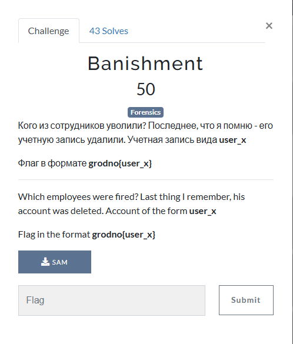

# Banishment

I downloaded the SAM file onto my Kali Linux VM, and ran `chntpw`. However, I couldn't find any deleted users. So, I copied and pasted the SAM file from my Kali Linux VM to my Windows machine. From there, I installed SANS's Registry Explorer, which is an even more in-depth look at the SAM file than `chntpw`. After some exploring, I noticed:

`user_21092` was banished into the shadow relem. I then submitted `grodno{user_21092}`, which solved the challenge.
