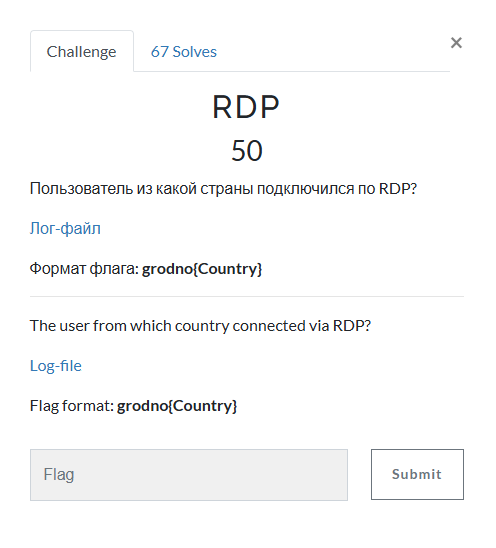
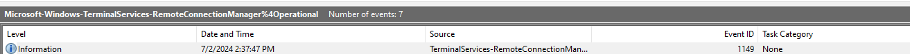
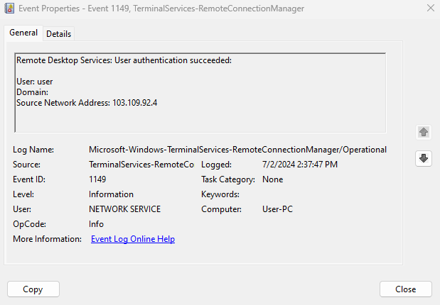
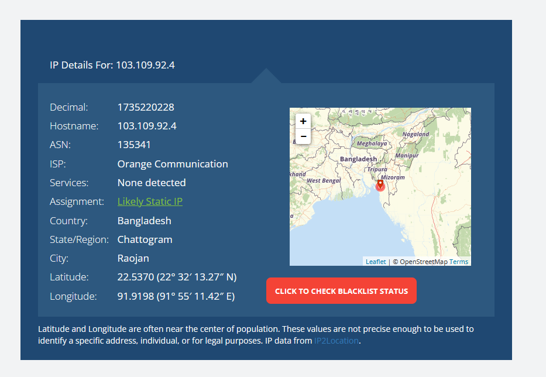

# RDP

I clicked on the link, which took me to a Google Drive folder, containing a zip file. I downloaded the zip file onto my Windows machine, and unzipped it, revealing that it contained 147 different Windows Event Viewer logs. In Windows Event Viewer, the Event ID for RDP is 1149. So, I searched each log, filtering all Event ID's to be 1149. Eventually, in `Microsoft-Windows-TerminalServices-RemoteConnectionManager%4Operational.evtx`:

I examined the log entry:

Knowing that the source network address was `103.109.92.4`, I used `whatismyipaddress.com` to find the country `103.109.92.4` originated from:

Since the country was Bangladesh, I submitted `grodno{Bangladesh}`, which solved the challenge.

