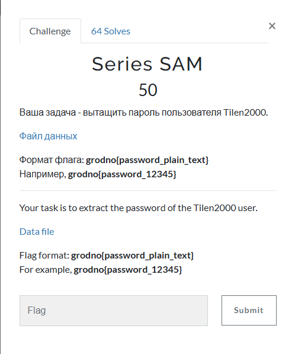
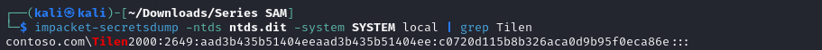
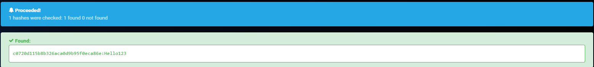

# Series SAM



I clicked on the link, which took me to a Google drive folder that contained two files: `ntds.dit` and `SYSTEM`. Since I had a `dit` and `SYSTEM` file, I used `impacket-secretsdump` to extract the hashed password of Tilen2000. So, I typed:

```txt
impacket-secretsdump -ntds ntds.dit -system SYSTEM local | grep Tilen
```

The `-ntds` flag specifies the ntds file, the `-system` flag specifies the system file, and the `-local` flag specifies to use local files, not files from an ip address. I then executed the command, which resulted in:



`contoso.com` is the domain, `Tilen2000` is the username, `2649` is the relative identifier for `Tilen2000`, `aad3b435b51404eeaad3b435b51404ee` is the Lan Manager (LM) value (legacy , `c0720d115b8b326aca0d9b95f0eca86e` is the NT hash (basically the password hash), and `:::` are just placeholder values. Since `c0720d115b8b326aca0d9b95f0eca86e` is the password hash, I must decrypt it in order to obtain the plaintext password. To do that, I used `hashes.com` hash decrypter. So, I inputted `c0720d115b8b326aca0d9b95f0eca86e` into the decrypter, and pressed decrypt, which resulted in:



`Hello123` is the password of the `Tilen2000` account. I then submitted `grodno{Hello123}` and solved the challenge.

