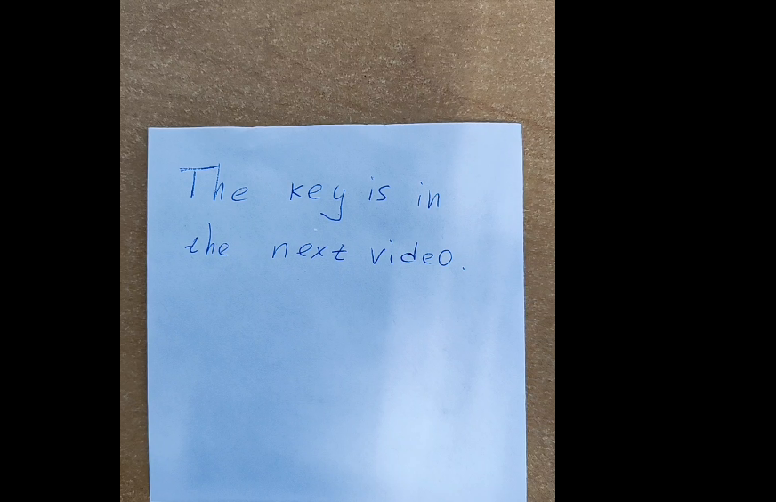
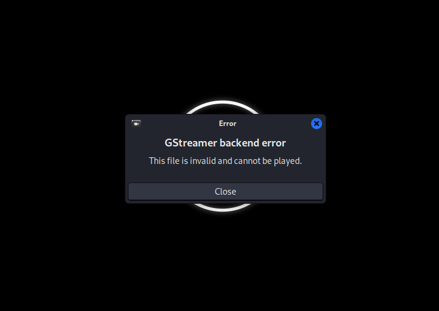
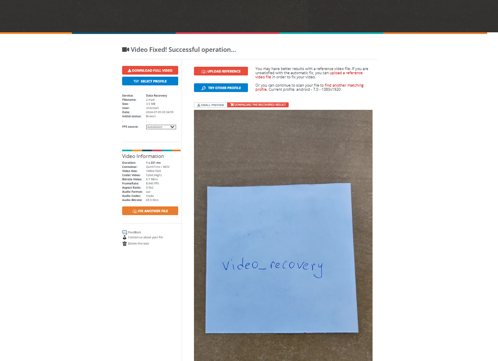

# Videomaker

I clicked on the link, which took me to a Google Drive folder that contained a RAR file called `Video.rar`. I then downloaded `Video.rar`, and placed it on my Kali Linux VM. From there, I extracted the archieve, which revealed two files: `1.mp4` and `2.mp4`. Playing `1.mp4` resulted in:

While playing `2.mp4` resulted in:

So, I used the website `fix.video` in an attempt to uncorrupt `2.mp4`. I uploaded `2.mp4` onto the website, and waited a couple of minutes for the results to come back. Would `2.mp4` be saved? The results came back, and:

The operation was successful! I then submitted `grodno{video_recovery}`, and solved the challenge.
