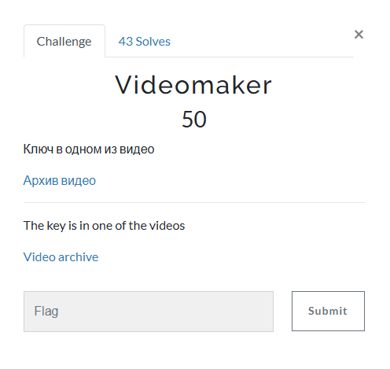

# Videomaker

I clicked on the link, which took me to a Google Drive folder that contained a RAR file called `Video.rar`. I then downloaded `Video.rar`, and placed it on my Kali Linux VM. From there, I extracted the archieve, which revealed two files: `1.mp4` and `2.mp4`

