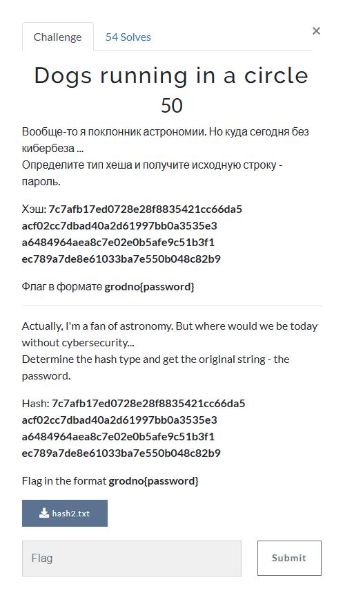
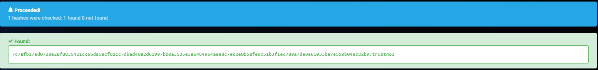

# Dogs running in a circle

I inputted `7c7afb17ed0728e28f8835421cc66da5acf02cc7dbad40a2d61997bb0a3535e3 a6484964aea8c7e02e0b5afe9c51b3f1ec789a7de8e61033ba7e550b048c82b9` into `hashes.com` hash decrypter, which resulted in:

The decrypted password is `trustno1`. I then submitted `grodno{trustno1} and solved the challenge.

