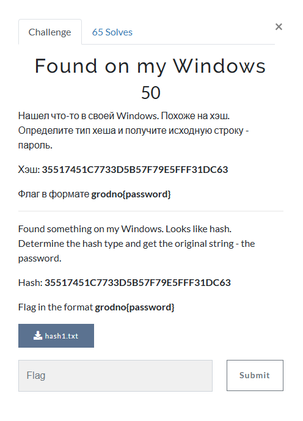

# Found on my Windows

This is the same challenge as `Dogs running in a circle`, just with a different hash. Anyway, I inputted `35517451C7733D5B57F79E5FFF31DC63` into `hashes.com` hash decrypter, which resulted in:

The decrypted password is `sakura`. I then submitted `grodno{sakura}, and solved the challenge.

