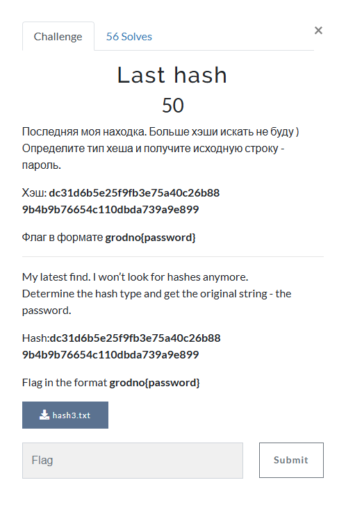
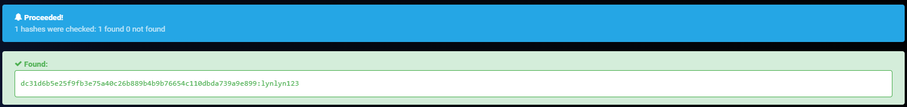

# Last hash

This is the same challenge as `Found on my Windows` and `Dogs running in a circle`, just with a different hash. So, I inputted `dc31d6b5e25f9fb3e75a40c26b88 9b4b9b76654c110dbda739a9e899` into `hashes.com`'s hash decrypter, which resulted in:

The decypted password is `lynlyn123`. I then submitted `grodno{lynlyn123}` and solved the challenge.
