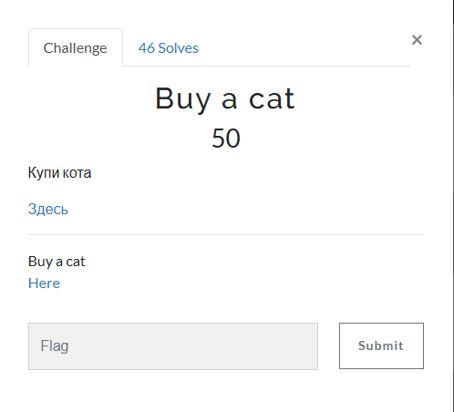
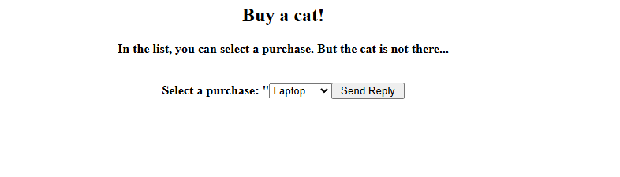
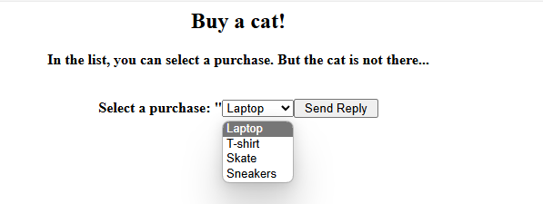
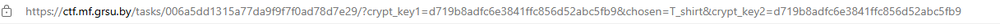
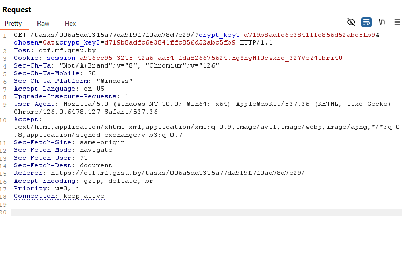
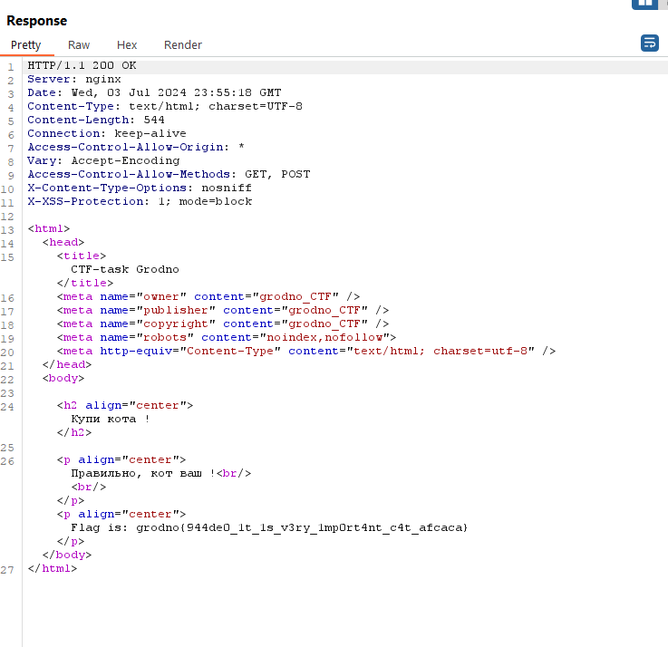

# Buy a cat

I clicked on the link, which took me to this site:

Here is what I could purchase:

I selected `T-shirt` and then clicked on `Send Reply`, where I was then sent to a different web page. However, when I looked at the url, I noticed something interesting:

`chosen=T_shirt`. I need to buy a cat, but the option isn't there. But what if it is there, but isn't displayed to the customer? So, I opened Burpsuite and changed `chosen=T_shirt` to `chosen=Cat`:

I then sent the request, which resulted in:

I then submitted `grodno{a457e0_1t_1s_v3ry_1mp0rt4nt_c4t_ef6ac6}` and solved the challenge.

