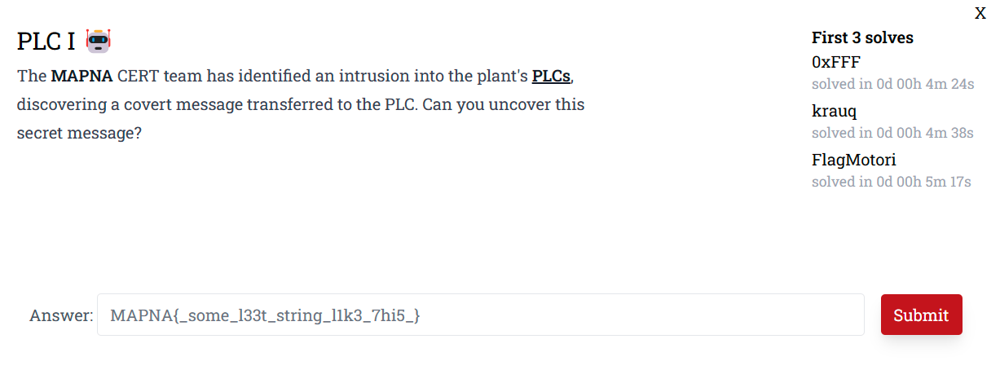
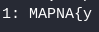
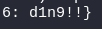
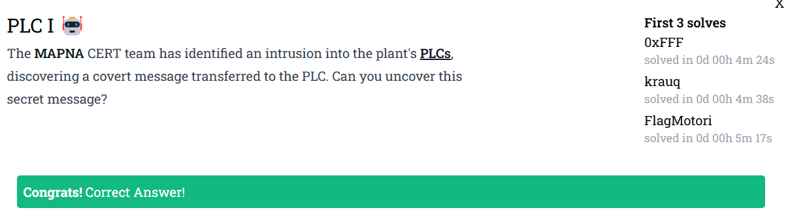

# Preface

# PLC I 🤖
The first thing I did was to click on the bolded and underscored word "PLCs", which downloaded the file `PLC_0829b4ef9780677086043add8592e996f21e0bbe.txz` onto my computer. I then sent `PLC_0829b4ef9780677086043add8592e996f21e0bbe.txz` to my Kali Linux shared folder, where I then unzipped it using my Kali VM. After I unziped `PLC_0829b4ef9780677086043add8592e996f21e0bbe.txz` the folder `PLC` was created. I then opened the `PLC` folder, which contained the file `plc.pcap`. Since this is a pcap file, I booted up the network analyzer/packet sniffer Wireshark, which can read PCAP's. I then skimmed over each packet in the pcap, until I reached packet 19. When I examined packet 19, I found this very interesting piece of data in the packet:


This seems to be a part of a flag. The `3:` also seems to indicate what part of the flag `Ld_4lW4` is. If I am correct, it would be part 3 of the flag. To make sure, I ctrl f'd ":" and set Wireshark to look for the character ":" in the packet details of each packet. Paging through the results, I would find:


I found the 5th part of the flag in packet 31.



I found the 1st part of the flag in packet 35. The `MAPNA{` solidifies that I am on the right track, as the flag format from the MAPNA ctf website is "MAPNA{}". 


I found the 4th part of the flag in packet 39.



I found the 6th part of the flag in packet 46.


I found the 2nd part of the flag in packet 50.

I then combined all of the parts together to get the flag:

```txt
MAPNA{y0U_sHOuLd_4lW4yS__CaR3__PaADd1n9!!}
```
I then submitted the flag in the answer box, and the result was:



Done.
