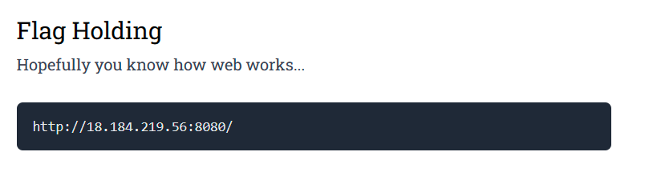

# Preface

# Flag Holding
The first thing I did when attempting this challenge was to `curl` `http://18.184.219.56:8080/`. So I typed:

```txt
curl http://18.184.219.56:8080/
```
Which resulted in this output:

```txt
<!DOCTYPE html>
<html>
<head>
        <meta charset="utf-8">
        <meta name="viewport" content="width=device-width, initial-scale=1">
        <title>Flag holding</title>
        <style>
                body {
                        background-color: #1a4a5e;
                }
                .msg {
                        text-align: center;
                        font-family: sans-serif;
                        color: white;
                        font-size: 40px;
                        line-height: 500px;
                }
        </style>
</head>
<body>
        <div class="msg" style="">
                You are not coming from "http://flagland.internal/".    </div>
</body>
</html>
```
Seems like I needed to be **Referred** from `http://flagland.internal/`. Therefore I typed:

```txt
curl -H "Referer: http://flagland.internal/" http://18.184.219.56:8080/
```
Simply put, this command is like asking a website for information but pretending you came from another website. The `-H "Referer: http://flagland.internal/"` informs the server that the curl command is coming from the referring website `http://flagland.internal/`. The output of the command was:
```txt
<!DOCTYPE html>
<html>
<head>
        <meta charset="utf-8">
        <meta name="viewport" content="width=device-width, initial-scale=1">
        <title>Flag holding</title>
        <style>
                body {
                        background-color: #1a4a5e;
                }
                .msg {
                        text-align: center;
                        font-family: sans-serif;
                        color: white;
                        font-size: 40px;
                        line-height: 500px;
                }
        </style>
</head>
<body>
        <div class="msg" style="">
                Unspecified "secret".   </div>
</body>
</html>
```
Looks like I need a secret to continue, so I typed:
```txt
curl -H "Referer: http://flagland.internal/" http://18.184.219.56:8080?secret  
```
The `?secret` portion sends the paramater `secret` to the server without any value. I did this to see if the server would give me anything if the value for the secret parameter was nothing. After I executed the command, the output was:
```txt
<!DOCTYPE html>
<html>
<head>
        <meta charset="utf-8">
        <meta name="viewport" content="width=device-width, initial-scale=1">
        <title>Flag holding</title>
        <style>
                body {
                        background-color: #1a4a5e;
                }
                .msg {
                        text-align: center;
                        font-family: sans-serif;
                        color: white;
                        font-size: 40px;
                        line-height: 500px;
                }
        </style>
</head>
<body>
        <div class="msg" style="">
                Incorrect secret. <!-- hint: secret is ____ which is the name of the protocol that both this server and your browser agrees on... -->   </div>
</body>
</html>
```
Both the server and my "browser" (the curl command) both agree on the `HTTP` protocol. Therefore the `secret` parameter must have the value of `HTTP` as the secret to enter. So I typed:
```txt
curl -H "Referer: http://flagland.internal/" http://18.184.219.56:8080?secret=HTTP
```
The `secret=HTTP` sends to the server the parameter `secret` with the value `HTTP`. The server will then check to see if this is the correct value. After I executed the command, the result was:
```txt

<!DOCTYPE html>
<html>
<head>
        <meta charset="utf-8">
        <meta name="viewport" content="width=device-width, initial-scale=1">
        <title>Flag holding</title>
        <style>
                body {
                        background-color: #1a4a5e;
                }
                .msg {
                        text-align: center;
                        font-family: sans-serif;
                        color: white;
                        font-size: 40px;
                        line-height: 500px;
                }
        </style>
</head>
<body>
        <div class="msg" style="">
                Sorry we don't have "GET" here but we might have other things like "FLAG".      </div>
</body>
</html>
```
Since `GET` is an HTTP request method, I would need to use `curl` with the `-X` method, which specifies a request method. Request methods are **always** in all caps. Since `FLAG` is in all caps, I typed:
```txt
curl -X FLAG  -H "Referer: http://flagland.internal/" http://18.184.219.56:8080?secret=HTTP
```
After I executed the command, the output was:
```txt
<!DOCTYPE html>
<html>
<head>
        <meta charset="utf-8">
        <meta name="viewport" content="width=device-width, initial-scale=1">
        <title>Flag holding</title>
        <style>
                body {
                        background-color: #1a4a5e;
                }
                .msg {
                        text-align: center;
                        font-family: sans-serif;
                        color: white;
                        font-size: 40px;
                        line-height: 500px;
                }
        </style>
</head>
<body>
        <div class="msg" style="">
                MAPNA{533m5-l1k3-y0u-kn0w-h77p-1836a2f} </div>
</body>
</html>
```
Theres the flag! I then entered:
```txt
MAPNA{533m5-l1k3-y0u-kn0w-h77p-1836a2f}
```
into the challenge box and the result was:


Done.
