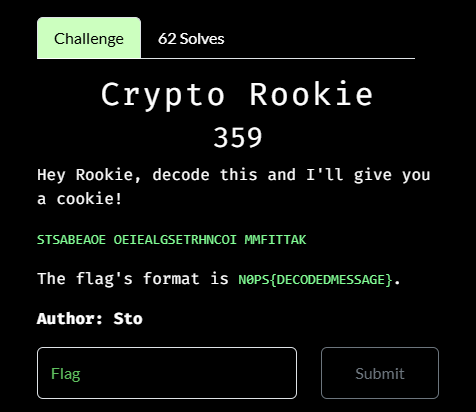
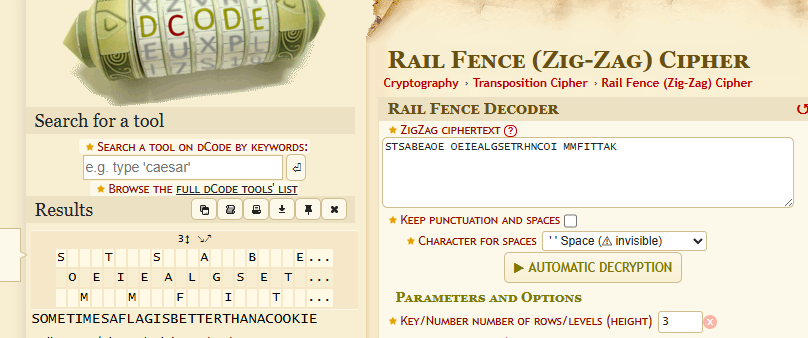

# Crypto Rookie

I used `boxentriq`'s cipher detecter, which identified the text as a RailFence Cipher. I then used `dcode.fr` RailFence Cipher decoder, which resulted in:

I then submitted `N0PS{SOMETIMESAFLAGISBETTERTHANACOOKIE}` as the flag and solved the challenge. At 62 solves and 359 points, this challenge is the highest points challenge that I have solved in my entire time of playing CTFs. It felt great. 
