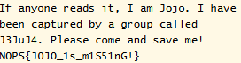

# Jojo is missing!

I joined the discord, and was greeted with this message:

I copied and pasted the text after the `here is the message` portion into an encoding identifier from `dcode.fr`, which identified the encoding as ASCII code. I then used their ASCII code decoder, which resulted in:

Oh no! I then submitted `N0PS{J0J0_1s_m1S51nG!}` as the flag and solved the challenge.
