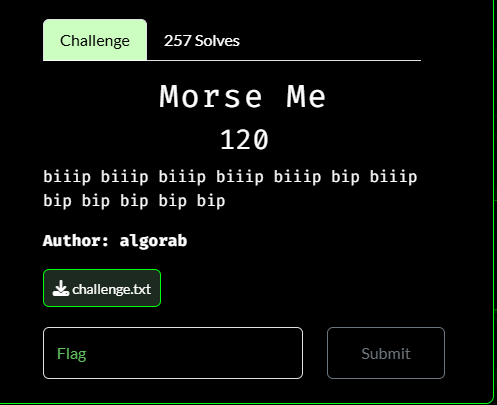

# Morse Me

I downloaded the file and opened it in a text editor, which displayed:

Which is morse code. I used CyberChef's morse decoder, which resulted in:

Which I recognized as hex, so I used CyberChef's hex decoder, which resulted in:

I then submitted `N0PS{M0rS3_D3c0d3R_Pr0}` as the flag and solved the challenge.

