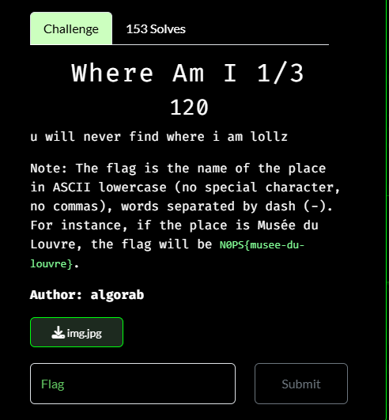
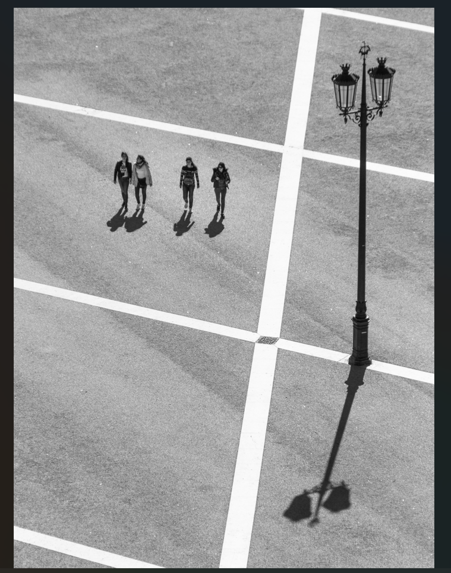
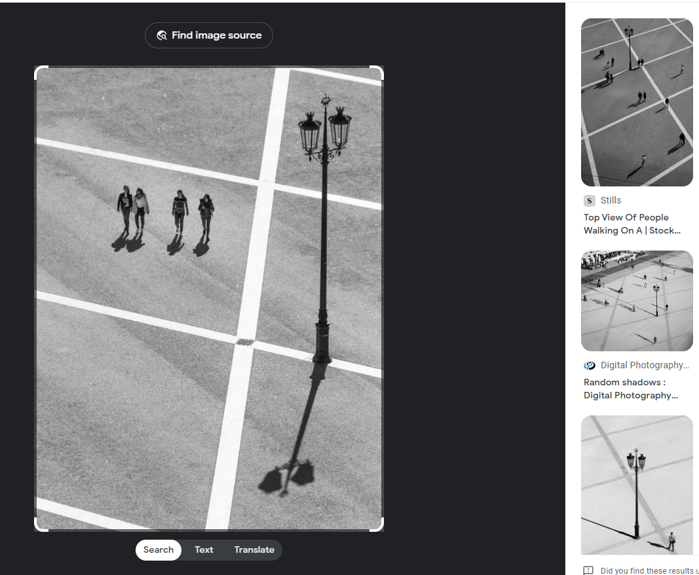
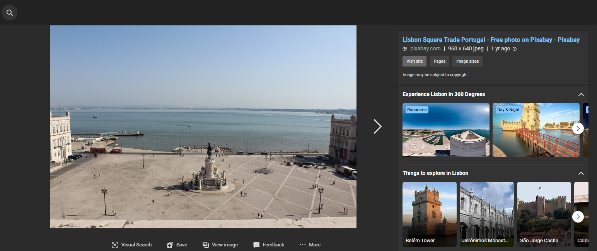
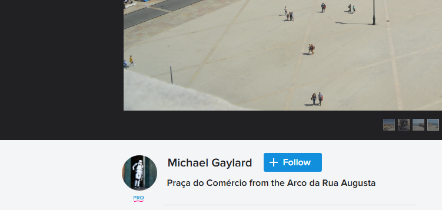

# Where Am I 1/3


I downloaded the file, which displays this image:



I used an online Exif viewer to see if the Exif location data was still in the image, however it was missing. I then used Google Image search to search for similar images:



I clicked on one of the similar photos and found that that photo was taken in Lisbon, Portgual. However, I needed to find the name of the place in Lisbon so I searched 
```txt
Lisbon Square with white lines
```

on Google, and browsed the images. While looking through the images I noticed:



The lines and the lamps are the same, so this is most likely the same place the image was taken. However, I need the exact name of the place, so I went to the page where the image was originally from:



Got it! Using the guidelines from the challenge description, I submitted `N0PS{praca-do-comercio}` as the flag and solved the challenge.

