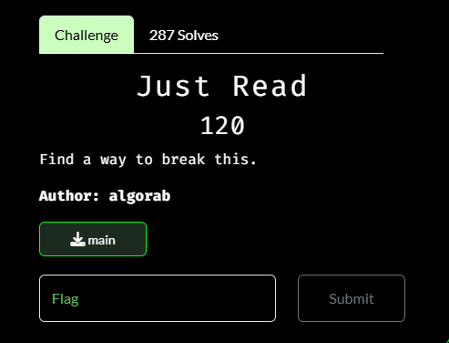
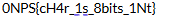

# Just Read

I downloaded the file and opened it in Ghidra. While browersing through the reverse-engineered code, I noticed:

The `{ }` point to this potentially being the flag, however everything is jumbled. So I copied and pasted the section of the code into an online notepad, and manually put together the text:

The N0PS is jumbled, but I submitted the flag anyway as `N0PS{cH4r_1s_8bits_1Nt}` and solved the challenge.
