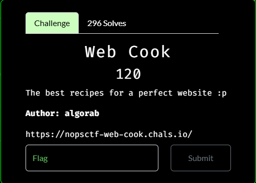
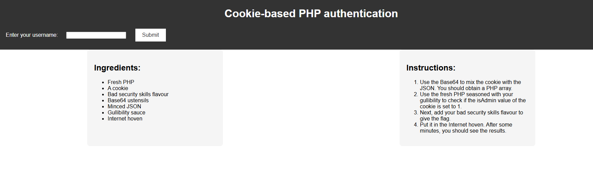
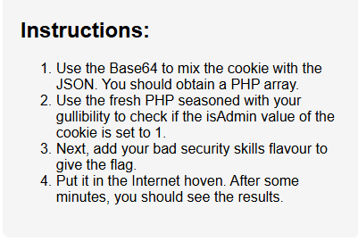
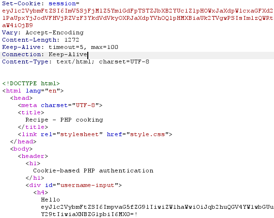
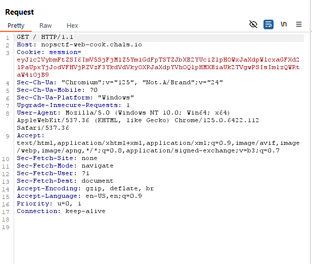
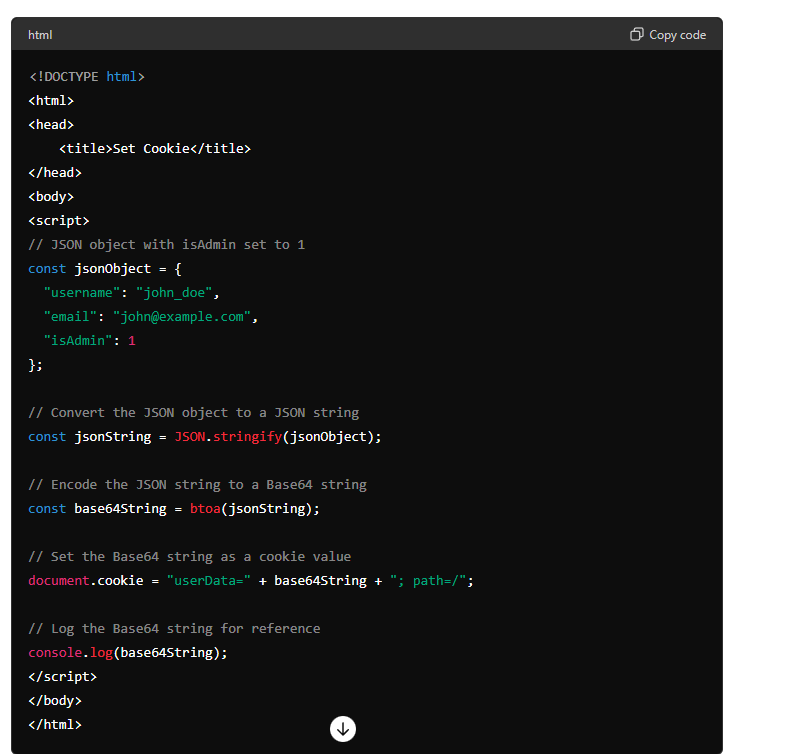
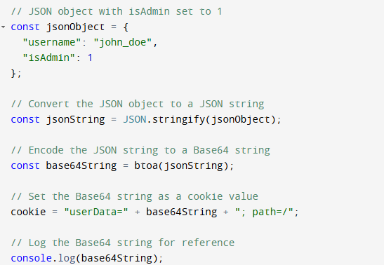
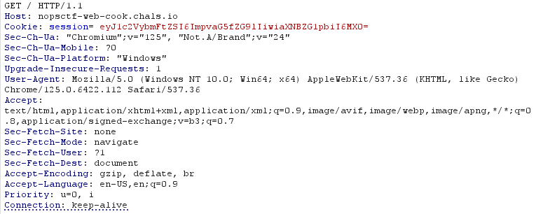
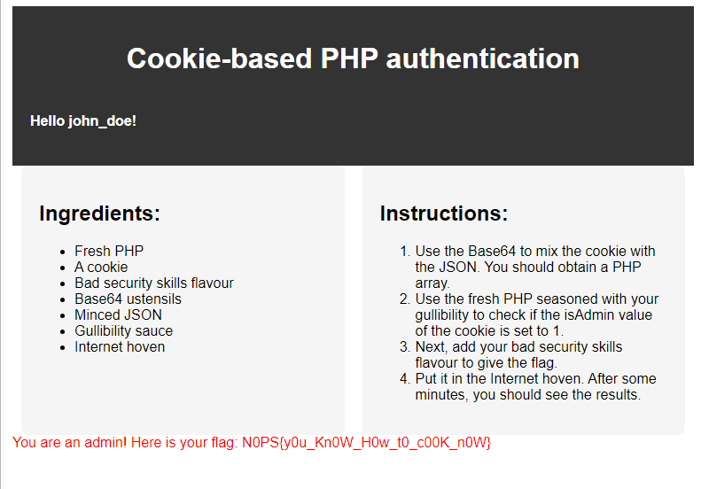

# Web Cook


I clicked on the link, which took me to this page:



The "instructions" for the "recipe" seem interesting:



Seems like they are the instructions for how to solve this challenge. So basically:

```txt
1. Make a PHP array out of JSON to set the isAdmin value to 1
2. Encode that PHP array with Base64
3. Make that encoded PHP array as the website cookie
4.????
5. Profit
```

After messing around with the website for a bit, I noticed that trying to resubmit a form causes this:


But if you delete the website cookie and refresh the page, the message goes away and the page is displayed normally. This points to the website using client-side validation, where the client computer is responsible for the validation of creditionals for the website. I opened up Burpsuite and used the Burpsuite browser to collect more information about the page. After some time I came across something interesting:



The `Set-Cookie: session =` is responsible for the cookie on the website. However, this was a response, not a request. After some more fiddling I was able to get a request with the `Set-Cookie: session = ` :



Which I sent to Repeater. I then used ChatGPT to create a template for a script that would create a cookie that I could insert into the `Set-Cookie: session = ` field that would set the `isAdmin` value to 1:



Which I modified to be:



As there are only two parameters for the cookie, the `username` and `isAdmin`. I than ran the script, which resulted in a cookie of:

```txt
eyJ1c2VybmFtZSI6ImpvaG5fZG9lIiwiaXNBZG1pbiI6MX0
```

I then inserted the cookie into the `Set-Cookie: session = ` field into the request in Repeater:



I sent the request, which resulted in:



I then submitted `N0PS{y0u_Kn0W_H0w_t0_c00K_n0W}` as the flag and solved the challenge.


