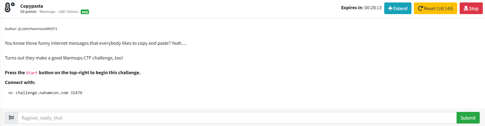
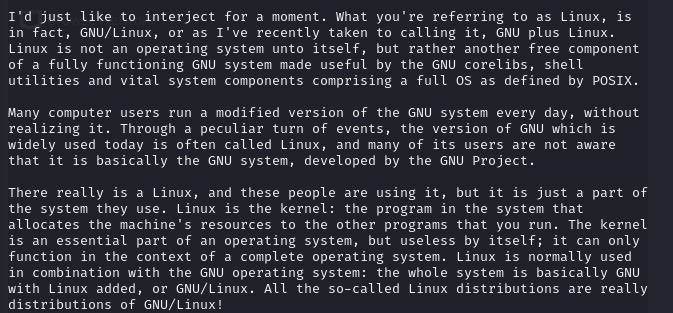
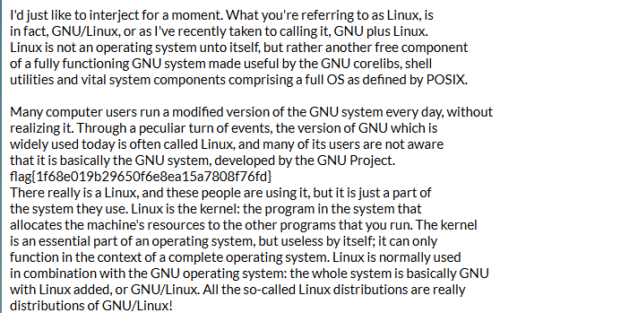

# Copypasta

As the challenge description tells me to connect to the server using:

```txt
nc challenge.nahamcon.com 31476
```
which is a netcat command (netcat is a tool that allows the user to read from and write to network connections using the TCP or UDP protocols from the command line). I do what must be done, which results in:



on the command line.

This is a famous quote by Richard Stallman, who acccording to Know Your Meme:

"Richard Stallman, often referred to by his webhandle rms, is the head and founder of the GNU Project, an online mass collaboration from which most Linux distributions draw their userspace from. Stallman is known for his fanatical dedication to free software, to the point that he accuses other contributors of being "traitorous", and vehemently insists that people refer to all Linux distributions as "GNU/Linux"."

Yeah. Interesting fellow. Anyway the quote in particular has become a copypasta, which is a block of text that is copied and pasted on the internet for humor. Since this is a copypasta, I copied and pasted the text from the command line to an online notepad, which resulted in:



I then submitted `flag{1f68e019b29650f6e8ea15a7808f76fd}` into the challenge box and solved the challenge.
