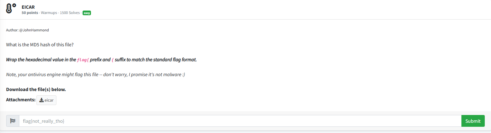
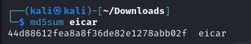

# EICAR


According to `eicar.org`: 

"The EICAR Anti-Virus Test File or EICAR test file is a computer file that was developed by the European Institute for Computer Antivirus Research (EICAR) and Computer Antivirus Research Organization (CARO), to test the response of computer antivirus"

So when I attemepted to download the file, my antivirus went ballistic. It wouldn't let me download it, and even after allowing the file, I couldn't find it on my computer. So I had to copy and paste the download link onto my Kali Linux VM in order to download the file. With the file downloaded, I opened the terminal in the directory where the eicar file was, and typed:

```txt
md5sum eicar
```

The `md5sum` command in Linux computes the md5 hash of a file. After I executed the command, the result was:



Since the challenge description states that the hash value is the flag text, I submitted `flag{44d88612fea8a8f36de82e1278abb02f}` into the challenge box and solved the challenge.
