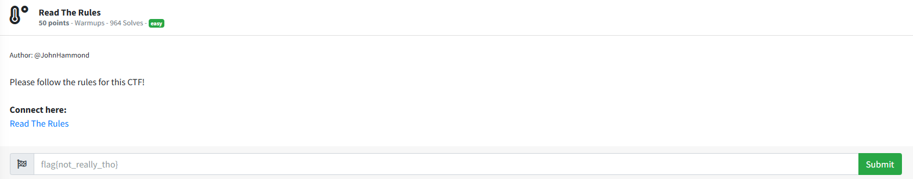
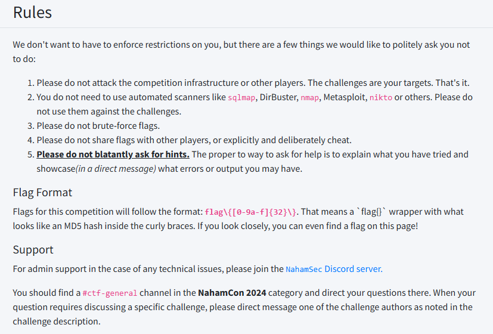
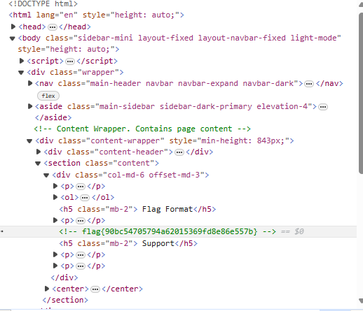

# Read The Rules

I navigated to the rules page, which displayed:

My first train of thought was that the flag on the rules page was `flag{[0-9a-f]{32}\}`, so I submitted it. It was incorrect. I was confused for a minute, so I read the rules in detail. The `if you look closely, you can even find a flag on this page!` caught my eye. So, I decided to open up Edge DevTools to see if the flag was hidden somewhere in the source code of the page. In the DevTools, I saw a comment mentioning a `Content Wrapper` on top of a class, so I expanded the class to see what was hiding inside, which resulted in:

Found you! I then submitted `flag{90bc54705794a62015369fd8e86e557b}` into the challenge box and solved the challenge.
