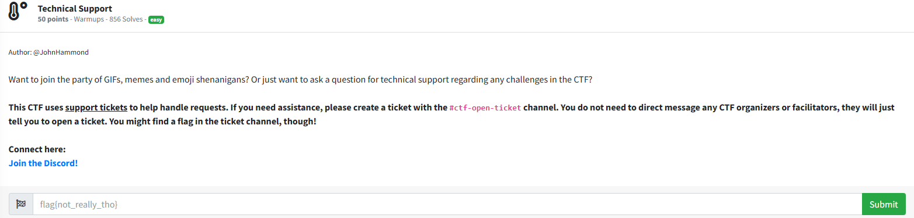
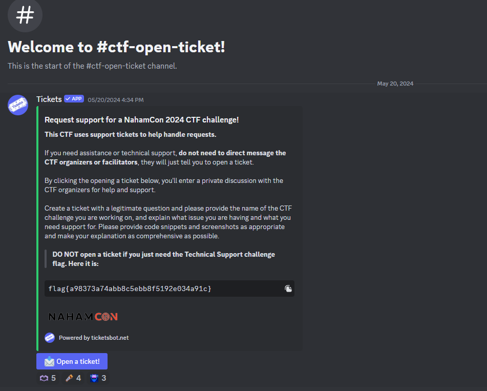

# Technical Support

I joined the discord, and navigated to the ctf-open-ticket channel, which displayed:

I then submitted `flag{a98373a74abb8c5ebb8f5192e034a91c}` into the challenge box and solved the challenge. 
