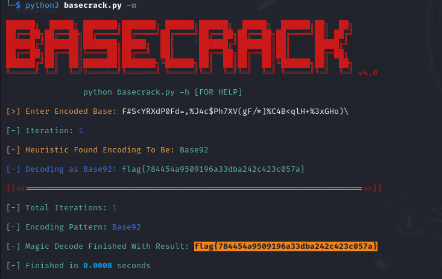

# That's Not My Base


I first tried to decode `F#S<YRXdP0Fd=,%J4c$Ph7XV(gF/*]%C4B<qlH+%3xGHo)\` using CyberChef, but it wasn't able to decode it. Since I keow that the text was encoded in a BASE varient, I researched over the internet in the hopes of finding something that would decode the text for me. I stumbled upon a tool called `BaseCrack` Github user `mufeedvh`. I followed the instructions from the page to install it on my Kali Linux VM:

[BaseCrack](https://github.com/mufeedvh/basecrack?tab=readme-ov-file#installation)

After I installed it I ran
```txt
python3 basecrack.py -m
```
In the folder where basecrack was installed. The `python3` command runs python scripts, which basecrack is. The `-m` flag is to set basecrack in `magic` mode, where it will automatically decode multi-encoded bases in one shot. I wasn't sure if the text was encoded multiple times, so 



